# Agent Workflow Orchestration Layer
As intelligent systems evolve beyond deterministic data-driven execution toward adaptive experience-driven behavior, the Agent orchestration should follow unique design principles to govern autonomous agents’ design, runtime behavior, and environments. This layer is responsible for carrying out the actions, invoking tools, making decisions, and adapting as needed. It executes the task graph that the Planning Layer created while obeying autonomy boundaries and runtime policies. The key components of this layer include

- Agent reasoning engine
- Tool invocation interface
- Context tracker (runtime state, memory)
- Learning and Adaptation
- Decision Engine
- Agent communication
- Multi-Agent Orchestration
- Adaptation logic (e.g., reinforcement policy or strategy switcher)
- Local threshold enforcer

Some of the key design principles are as follows:
**1. Execution must know the agent’s confidence** — Agents should condition their execution flow based on the internal confidence of a given decision or action. When confidence levels fall below a defined threshold, the system must initiate a human-in-the-loop (HITL) protocol or trigger predefined safe fallback behavior. This mechanism ensures robustness under uncertainty, especially in real-world environments where interpretability and trust are paramount.

**2. Tool invocation must adhere to explicit scope and policy constraints** -  Autonomous agents must validate that any attempted tool usage conforms to policy-defined boundaries, including access privileges, data sensitivity levels, and legal constraints, not merely logical task compatibility. This ensures governance and prevents unauthorized tool behavior or data exfiltration.

**3. Each execution step must be atomic and traceable.** Every operational action (including intermediate steps) must be logged with clear input-output mappings, decision rationales, and timestamps. This atomic traceability supports rollback mechanisms, compliance auditing, and post-hoc explainability—critical elements in experience-driven, accountable AI.

**4. Decision strategies must adapt to the environmental context**—e.g., adjust ranking models based on environmental signals to promote robust, context-sensitive behavior.

**5. Design must accommodate tool imperfection and failure**—Agents must dynamically modify inference models or decision criteria by interpreting contextual signals from their operational environment. For instance, reranking outputs using real-time telemetry or altering planning algorithms based on sensed constraints enhances resilience and context sensitivity.

**6. Soft policy violations must be persistently logged** — No execution path should be architected under the assumption of perfect reliability from any tool. All tooling interactions must be encapsulated with error handling, retry limits, and redundant alternatives to ensure continued service availability under failure conditions.

**7. Execution should obey rate limits, budgets, or user-defined constraints** — Autonomy does not imply unlimited access to system resources. Agents must dynamically enforce external constraints to maintain fairness, performance, and stakeholder trust in shared digital ecosystems. Even when a breach of agent policy does not lead to critical failure, the incident must still be recorded. Such "near-miss" events help identify ethical drift, unanticipated behaviors, and areas where policy or training requires reinforcement.
**8. Retries should be capped and logged with a reason**—Avoid infinite loops or silent degradation to protect against runaway agents and unclear failure modes. This helps trace failure patterns and supports proactive remediation.

**9. Tool selection must align with declared intent and conform to governing policies** — Agents must prioritize tool invocation based on goal congruence, not convenience or latency. Selection algorithms should evaluate tools against the user’s intent model and applicable organizational policies to ensure relevance, efficiency, and compliance.

**10. Tools must expose metadata about their internal confidence and operational health**. Each tool interface must emit real-time diagnostics, including reliability scores, performance statistics, and error traces, to support agent-level metacognition and intelligent fallback mechanisms.

**11. Tool interactions must be logged as part of the decision provenance** — Every tool invocation must include records of inputs, outputs, invocation timestamps, and contextual conditions. This enables downstream traceability, reproducibility, and forensic analysis of agent behavior.

**12. Memory systems must be session- or mission-scoped by default** — Persistent memory must not be assumed. Unless explicitly declared and consented to by the user or operator, all memory should reset at session termination, safeguarding privacy and preventing unwanted information carryover.
**13. Context variables must be both version-controlled and time-stamped** — To ensure decision quality and reproducibility, all contextual dependencies (e.g., configurations, environmental readings, preference settings) must carry metadata indicating their version and time of capture. This guards against the use of stale or deprecated inputs.
**14. Memory must be fully auditable and compliant with data governance.** — All modifications to agent memory — including deletions, overwrites, and merges — must be recorded with actor, time, and rationale metadata. This enables policy compliance, accountability, and rollback in experience-critical systems.

Here is a list of best practices for Agent Orchestration Layer:
 - Use decorators or wrappers to enforce tool usage policies at runtime — This isolates compliance logic from agent reasoning.
 - Integrate a memory layer for intermediate state tracking — This helps agents reflect and iterate.
 - Restrict real-time learning unless explicitly allowed. Autonomous adaptation must be governance-aware.
 - Log each decision with a “why this, not that” justification. This is Useful for downstream auditing and fairness analysis.
 - Fail closed where appropriate — If ethical or policy boundaries are violated, agents should stop rather than guess.
 - Segment tools by sensitivity class (e.g., public vs. internal) — Use strict access gates.
 - Implement circuit breakers for tool failure patterns — Avoid system-wide degradation.
 - Avoid uncontrolled growth of memory — Apply pruning or summarization over time.
 - Use semantic indexing for memory retrieval — Enables smarter recall during reasoning.


## Exploring Different Workflow Execution Patterns

Agentic Workflow Execution pattern can be validated based on several agents, such as:
- Single Agent 
- Multiple Agents


### Single Agentic workflow
A Single-Agent Autonomous Workflow is one where the agent executes the entire process from start to finish without orchestration or collaboration. The agent is fully self-contained, working within a clearly defined scope and policy envelope. It operates with bounded autonomy, making all decisions internally and escalating to human oversight only if a predefined threshold is breached, such as low confidence or access denial.


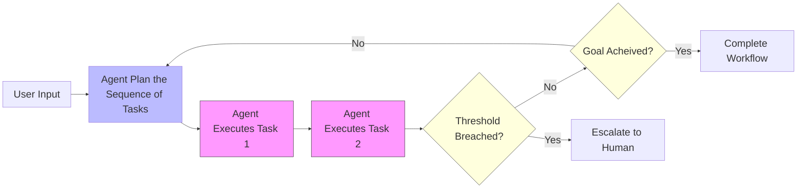
*Figure 1: Singleton Agentic Workflow*

A well-known format of single-agentic workflow is the **Explain-and-Act Pattern**. Before executing a decision, the agent generates a detailed plan and explanation and optionally waits for approval. Google's Gemini Deep Research Agent uses this pattern for any Deep Research Request. This works perfectly where *Explainability* is a prerequisite before autonomy.

A single agent can also perform an activity in multiple stages. In a Multi-Stage Planning Workflow, a single agent dynamically sequences subtasks in response to a high-level intent. Instead of following a linear script, the agent plans its steps based on the current environment, tool availability, and mission constraints. This structure allows the agent to adapt execution paths in real time, select or skip steps, and retry where needed, always working toward fulfilling the overarching goal autonomously. In this pattern, it is also possible to define some threshold, such as a maximum number of retries and others, and once the threshold is breached, the workflow reaches the final state. Like a GPS that re-routes based on traffic, the agent changes its task plan depending on what’s happening around it.


### Multiple Agent-based workflow

The Multi-Agent Collaborative Workflow distributes a complex task across multiple agents, each with a specialized responsibility. Agents operate in parallel or sequence, often communicating through shared memory or message protocols. This model reflects a system where coordination, delegation, and task ownership are essential, and collective success depends on modular task design and inter-agent reliability.

Multiple agent-based workflow allows complex processes to be built by composing agents within clear control structures. Here is a standard structure of multiple agents 

- Sequential Workflow
- Parallel Workflow
- Multi-Stage Loop Workflow

#### Sequential
This method specifies the primary and secondary agents in an ordered sequence. Each executes a predefined sequence of steps, which may involve reasoning, tool use, or memory update, proceeding one by one until the workflow completes or is interrupted. Agent dynamically sequences subtasks to achieve a declared mission, choosing tools/actions at runtime. Each step is executed linearly, and the agent does not plan dynamically; its value lies in discipline, traceability, and procedural consistency. Think of an intern following a checklist for onboarding a new employee. This can be designed using multiple agents in a sequence. 
- Step 1: Agent 1 sends a welcome email.
- Step 2: Agent 2 creates the employee folder.
- Step 3: Agent 3 schedules orientation.

Each step is defined, ordered, and must be followed before moving on. Figure [2] summarizes the steps in the Sequential Agentic workflow. Here are some suitable use cases for the following:, 
  - The process is repeatable and linear	
  - Steps require tool use, not planning	
  - Auditability is critical


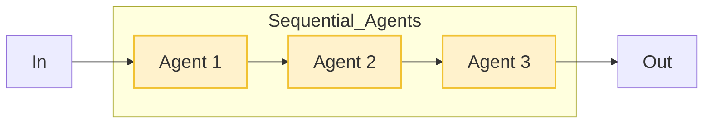
*Figure 2: Sequential Agentic Workflow*

Here are some key characteristics for Sequential Agentic Workflow:

- A Sequential Agent is ideal when the task structure is known in advance and the order of operations is clear.
- It provides determinism, making testing, debugging, and governing easy.
- While each step can involve intelligent reasoning or tool usage, the sequence itself is static — decisions happen inside steps, not between them.
- The agent can still log, observe, and escalate as needed, but does so within a known task boundary.

The Sequential Agent offers a stable, interpretable framework for agentic execution — perfect when repeatability, safety, and traceability outweigh the need for autonomy in task selection. It’s the agentic equivalent of a trusted assistant following a proven protocol, capable of reasoning within steps but never reordering the plan.


#### Parallel 

A Parallel Agent is an orchestrating agent that breaks a mission into independent subtasks, delegates each to a sub-agent or tool, and executes them concurrently. It then aggregates the results and returns a unified output. The parallel pattern is ideal when tasks don’t depend on one another and can be performed in isolation, significantly improving speed and throughput. However, the Planner needs logic to detect failure, handle timeouts, and retry subtasks where required. For example, 


Parallel patterns are functional when:
- Tasks are logically independent
- Performance or throughput is critical
- Sub-agents have distinct capabilities or access


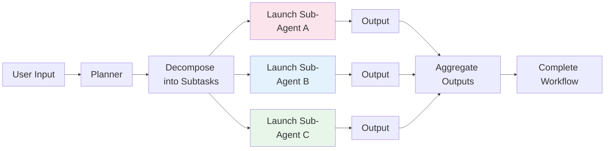
*Figure 3: Parallel Agentic Workflow*

The Parallel Agentic Workflow is like a conductor directing multiple musicians at once. The music only works when each player knows their part — but when they do, the result is fast, harmonized, and high-impact.


#### Loop
A Loop Agent is an agent that continuously loops through a structured decision cycle — asking what it should do next, executing actions, observing outcomes, and refining its reasoning — until a terminal condition is met (success, failure, or stop signal). For example, Iterative summarization, feedback cycles, and multi-pass classification are good use cases for Loop-based agentic workflow patterns. An example can be an HR agent refining résumé summaries until they meet clarity and compliance rules or receive human approval. The execution of the workflow happens in a loop through the following activities:
The agent begins each loop iteration by observing the current context, which includes the environment state, task progress, feedback, and memory. 
Based on what it sees, the agent decides what action to take. This can involve calling a tool, rewriting the plan, or continuing a previous task. 
- The agent performs the selected action — often invoking a tool, querying a document, generating a sub-plan, or interacting with an API. 
- The agent observes the result of the action, evaluates whether progress was made, and stores the result in memory.
- If the goal is reached, no further actions make sense, or if failure is detected, the loop ends. Otherwise, the cycle repeats.

Loop agents are ideal for:

- Tool-based reasoning (e.g., "Toolformer"-style architectures)
- Multi-step question answering
- Iterative data extraction
- Exploration or simulation tasks
- Self-debugging agents (e.g., code refactors)


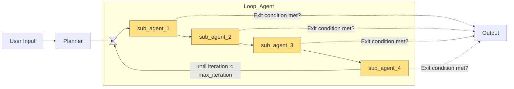
*Figure 4: Loop Agentic Workflow*


Following table summarizes the comparative analysis of the three multi-agent workflow patterns: 

| Workflow Type       | Planning | Execution Style | Adaptivity | Best For |
|---------------------|----------|------------------|------------|----------|
| **Sequential Agent**    | Fixed    | Ordered          | Low        | Rule-based tasks |
| **Loop Agent**          | Emergent | Iterative        | High       | Self-correcting tasks |
| **Parallel Agent**  | Static or light dynamic | Concurrent | Medium     | High-volume subtasking |

*Table: Comparative analysis of the three multi-agent workflow patterns*

## Discovering the key elements for the Agentic AI Workflow

An agentic workflow is not just a sequence of actions — it is a goal-oriented orchestration framework involving autonomous reasoning, learning, human collaboration, and transparent delivery. The following components together form the adaptive engine that powers such workflows. For these types of workflow, we can easily determine that the key element of any Agentic AI workflow includes:
- **User Input (Initiator):** The agentic system typically begins when a user provides a goal, query, or scenario, not step-by-step instructions. This is the system’s source of intent. For example, the User can send the query as 
   > Find the top 5 candidates for this role with high writing skills.
- **Planner (Goal Inception + Task Orchestration):** The Planner transforms a high-level goal into an actionable execution strategy by breaking it into tasks and managing their flow. It includes the following subfunctions:
  - **Goal Inception:** Recognizes mission scope and outcome definition.
  - **Intent Determination:** Interprets user goals into operational logic.
  - **Task Decomposition:** Breaks down the goal into modular subtasks.
  - **Threshold Definition:** Sets confidence, ethical, or quality thresholds for each task.
  - **Orchestrator / Task Distributor:** dynamically assigns tasks to tools, agents, or sub-agents.
- **Agent (Executor & Decision-Maker):** This active unit executes the tasks using reasoning, tools, adaptation, and feedback. It may be a single agent or a swarm of cooperating agents. It is capable of:
  - **Tool Invocation:** Calls APIs or external services (e.g., summarizers, databases).
  - **Resource Coordination:** Manages input/output pipelines and memory buffers.
  - **Reasoning:** Makes logical decisions and handles branching.
  - **Adaptation & Learning:** Refines approach based on context or past results.
  - **Execution:** Carries out actions within policy boundaries.
- **Evaluator–Optimizer (Feedback Integrator):** This component assesses outcomes of actions based on pre-set goals, user feedback, policy constraints, or learned improvements. It includes:
  - **Feedback Reception:** Accepts reviews or metrics from users, logs, or monitors.
  - **Error/Deviation Detection:** Checks if actions deviate from thresholds.
  - **Optimization Signals:** Sends updates to the planner or agent for refinement.
- **Output Aggregator (Final Composer):** Before delivering results, the orchestrator or result orchestrator merges, ranks, explains, or packages all partial results or agent decisions into a coherent output.
- **Output (Deliverable + Explanation):** The final, human-consumable product — paired with an explanation of how and why it was produced.


### Workflow Orchestration Design Pattern

Based on the relation among the sub-agents and the primary agent, we can have 

The orchestration pattern can be categorized into multiple categories, such as
- Orchestration Patterns
- Task Decomposition Patterns
- Model Coordination Pattern 
- Process Management Pattern 
- Collaboration Pattern


#### Orchestration Patterns

Let’s start with  Orchestration Patterns, including:

- Federated Coordination Pattern
- Hierarchical Orchestrator Pattern
- Marketplace Pattern 
- State Machine Pattern 
- Policy-Based Routing Pattern


##### Federated Coordination Pattern
The Federated Coordination Pattern distributes control among autonomous agents collaborating without a centralized authority. Each agent maintains independence but adheres to shared protocols or synchronization mechanisms to contribute to a collective outcome. This pattern emphasizes decentralization, enabling scalability, fault tolerance, and local autonomy. Imagine multiple regional customer support chatbots working to resolve a multilingual customer inquiry. Each bot specializes in a particular language and jurisdiction. They synchronize via a shared event bus, updating status and handing off tasks as needed, but no single bot controls the whole conversation.


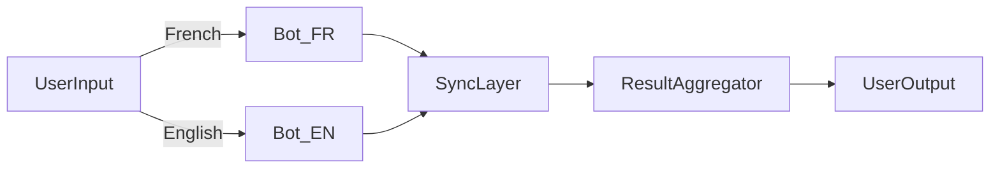
*Figure: Federated Coordination Pattern*

This pattern is ideal for distributed AI ecosystems, IoT systems with heterogeneous sensors and devices, or federated learning models where data cannot be centralized due to privacy or governance constraints.


##### Marketplace Pattern 

The Marketplace Pattern introduces a competitive environment where agents "bid" or volunteer for tasks from a shared task pool. Decision-making is dynamic, based on availability, skill match, cost, or resource constraints. The highest-value proposal wins the right to execute the task. For example, an AI platform hosts a pool of compute-intensive tasks. Multiple agents offer to execute jobs, pricing their offer based on their current load and specialization. A lightweight broker agent selects the most cost-effective or performant proposal.


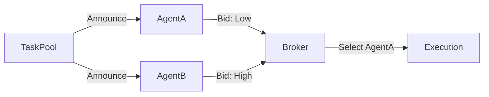
*Figure: Marketplace Pattern*


Marketplace Pattern is well-suited for decentralized AI workloads, compute resource brokering, or data labeling tasks across microservices. Enables horizontal scaling with market-like incentives.


##### Hierarchical Orchestrator Pattern

The Hierarchical Orchestrator Pattern centralizes control in a top-level agent (or orchestrator) that delegates tasks to sub-agents organized in a hierarchical structure. Each sub-agent may further delegate responsibilities, forming a tree-like command and control model. This approach ensures accountability, layered processing, and clear ownership. For example, a project lead agent breaks down a product launch into phases and assigns milestones to marketing, engineering, and compliance agents. These department-level agents then coordinate with submodules or bots under their scope to complete their portions.


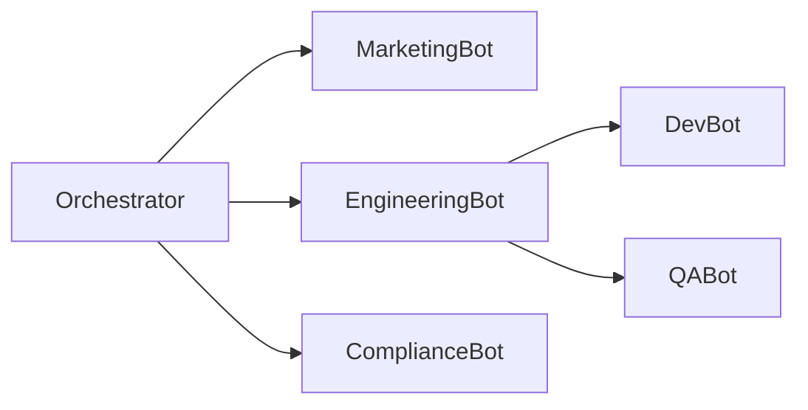
*Figure: Hierarchical Orchestrator Pattern*

This pattern is typical in enterprise systems where business workflows must be coordinated across departments. It supports scalability while retaining centralized oversight, which is helpful for project management, supply chain orchestration, or regulatory compliance workflows.


##### State Machine Pattern
The State Machine Pattern models agents as moving between discrete states with well-defined transitions triggered by events or conditions. This deterministic flow ensures that all operations are traceable and follow business logic rules, which is critical in compliance-heavy or transactional domains. For example, a document submission agent begins in an "Idle" state. Upon receiving input, it transitions to "Validation". If successful, it proceeds to "Submission"; otherwise, it loops back to "Idle" with an error flag.


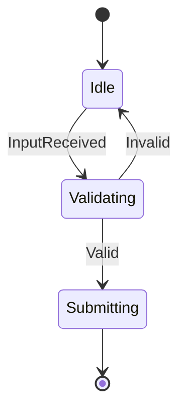
*Figure: State Machine Pattern*

This pattern is essential in domains like workflow automation, government services, or process engines where auditability and state consistency are crucial.

##### Policy-Based Routing Pattern
The Policy-Based Routing Pattern assigns tasks based on formalized rules, roles, or classifications. Decision logic is encoded as policy rather than dynamic bidding or orchestration, enabling deterministic, auditable, and compliant workflows. For example, a chatbot platform receives sensitive legal queries. Based on internal policy, only certified legal agents can handle such requests. The router applies a decision matrix and forwards the query accordingly.


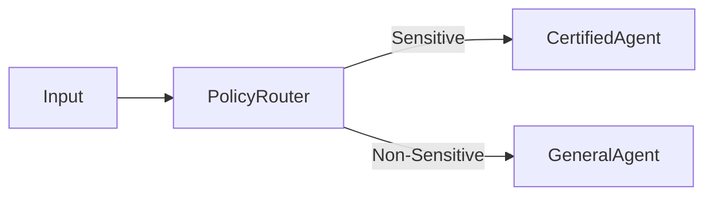
*Figure: Policy-Based Routing Pattern*

Policy-based routing Patterns are critical in domains with compliance needs, such as financial services, healthcare, or HR systems, where task routing must obey explicit legal or ethical boundaries.


#### Task Decomposition Design Patterns
In many multi-agent systems — particularly those tasked with fulfilling complex or multi-step objectives — a central challenge lies in breaking down higher-level goals into executable, atomic subtasks. This process, known as task decomposition, determines how intelligence is distributed, how subtasks are delegated, and how overall system efficiency and clarity are maintained.

Unlike coordination or orchestration patterns, which focus on agent interactions or control models, task decomposition patterns address the internal logic of problem breakdown. They dictate how agents interpret, divide, and assign work based on structure, capability, or constraints.

In this section, we will explore task decomposition patterns, including:

- Recursive Breakdown Pattern
- Tool-Aware Mapping Pattern
- Dependency-Driven Split Pattern
- Role-Based Delegation Pattern
- Semantic Layering Pattern

##### Recursive Breakdown Pattern
The Recursive Breakdown Pattern is a strategy in which a complex task is iteratively divided into smaller subtasks until each unit is atomic, meaning an agent or system can directly execute it without further division. This pattern is inherently hierarchical, with parent tasks spawning children, who may become parents themselves, and so on. Consider a digital travel concierge asking to “Book a trip.” This high-level task decomposes into flight booking, hotel reservation, car rental, and itinerary scheduling. The “flight booking” task might then split into “search flights,” “select flight,” “enter passenger details,” and “process payment,” each of which may decompose even further.


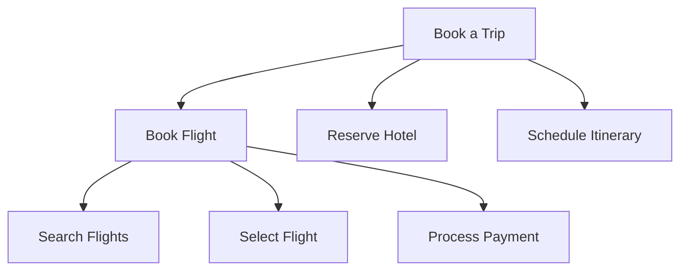
*Figure: Recursive Breakdown Pattern*

This pattern is essential in domains like automated planning, robotic control, or customer service agents, where understanding and execution must bridge abstract goals and concrete operations. Recursive decomposition enables traceability, reusability of subtasks, and stepwise refinement of goals.

##### Tool-Aware Mapping Pattern

The Tool-Aware Mapping Pattern organizes task decomposition based on the tools or systems available to perform subtasks. Instead of breaking down work strictly by logic or function, this pattern maps each subtask to the most appropriate technological interface, such as APIs, databases, or AI models, thereby optimizing execution. For example, when given a task to “generate a report,” an AI assistant might route the data fetching to a SQL engine, delegate visualization to a charting API, and handle narrative generation using a language model. Each step is bounded by what a given tool can perform, ensuring capability-aligned decomposition.


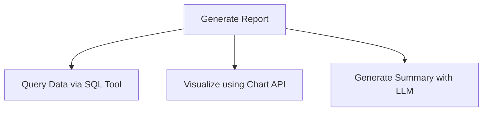
*Figure: Tool-Aware Mapping Pattern*

The Tool-Aware Mapping pattern is particularly useful in intelligent workflow systems, RPA bots, or developer assistants that need to sequence tool invocations across a task graph. It’s also foundational for building modular AI agents that interface with external systems like databases or analytics dashboards.


##### Dependency-Driven Split Pattern
The Dependency-Driven Split Pattern decomposes tasks according to input/output dependencies between subtasks. Execution order is determined by what data or conditions must be satisfied before a subtask can begin, forming a directed dependency graph. For example, a bot assigned to “send a marketing email” cannot proceed until it first retrieves contact lists. That, in turn, depends on the authentication of access credentials. Each downstream task hinges on completing the prior steps and data output.


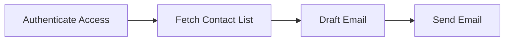
*Figure: Dependency-Driven Split Pattern*

This pattern is crucial for business process automation, ETL pipelines, or any context where tasks are logically sequential and data-dependent. It enforces correctness and guards against premature or invalid execution.

##### Role-Based Delegation Pattern

The Role-Based Delegation Pattern breaks down tasks by matching each subtask to an agent with a specialized capability or role. Instead of centrally executing each part, the system leverages modular agents — each responsible for a domain-specific function (e.g., math, writing, data handling). For example, when a user asks, “Summarize the monthly revenue and write an executive summary,” the math agent processes revenue calculations, while the language model agent generates a narrative summary. A coordinator agent ensures proper sequencing.


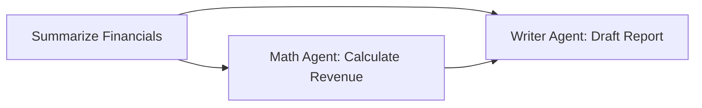
*Figure: Role-Based Delegation Pattern*

 The Role-Based Delegation Pattern is foundational in LLM orchestration, modular AI platforms, and cooperative agent teams. By leveraging best-fit execution roles, this pattern increases maintainability, parallelism, and accuracy.


##### Semantic Layering Pattern
The Semantic Layering Pattern decomposes tasks into layers of abstraction, beginning with high-level intent and refining downward into actionable plans. This approach mirrors human strategic thinking: from goals to tactics to execution. For example, a curriculum planning agent might first define the overall learning objectives (strategy), then map those to weekly learning goals (tactics), and finally generate daily exercises or assessments (execution).


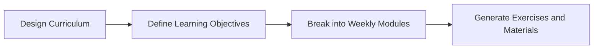
*Figure: Semantic Layering Pattern*

 The Semantic Layering Pattern is ideal for planning-intensive domains like education design, project strategy bots, or long-form content generators. It allows different agents to operate at different abstraction layers—one for high-level vision and another for task execution.

Having explored how tasks can be intelligently decomposed based on structure, capability, and logic, we now focus on Process Management Design Patterns. This category focuses not on what work is done, but how that work is governed, tracked, and recovered over time.


#### Process Management Design Patterns

While decomposition and coordination define what tasks are broken down and who executes them, process management design patterns focus on how tasks are governed during execution. These patterns are essential for systems that operate over extended timeframes, involve state transitions, or must recover from interruptions or inconsistencies.

Process reliability and traceability become critical in agent-based architectures, especially real-world applications like healthcare, logistics, or finance. Therefore, these patterns introduce structures that manage workflows, monitor execution, preserve state, and handle exceptions intelligently. The main patterns are 

- Blackboard Collaboration
- Workflow-as-Context
- Stateful Orchestration
- Checkpoint and Resume
- Exception Escalation


##### Blackboard Collaboration Pattern

The Blackboard Collaboration Pattern enables multiple agents to contribute to a shared knowledge repository — the "blackboard" — where intermediate results, hypotheses, or partial solutions are posted. Other agents can read, modify, or refine these entries, leading to emergent solutions through indirect coordination. For example, different bots contribute to a shared incident dashboard in a disaster response scenario. A sensor agent reports fire, a mapping agent adds building layouts, and a strategy agent proposes evacuation plans — all collaborating via the blackboard without direct interaction.


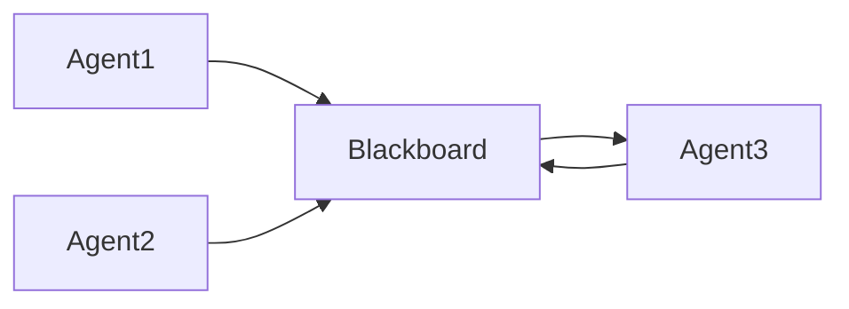
*Figure: Blackboard Collaboration Pattern*

This pattern is well-suited for diagnostic systems (e.g., medical or system failure diagnostics), collaborative research assistants, or emergency response planning, where multi-perspective input is needed to converge on a solution.

##### Workflow-as-Context Pattern

The Workflow-as-Context Pattern enforces that every task or action an agent performs is part of a broader process definition. This pattern provides a contextual frame, meaning each execution step is traceable, repeatable, and bound by a pre-defined flow with start-to-end semantics. For example, in an e-commerce system, every "order processing" operation (validation, payment, packaging, shipment) is logged and executed within a managed workflow engine. The agent executing “package item” knows the status of “payment confirmation” because it operates within the same workflow scope.


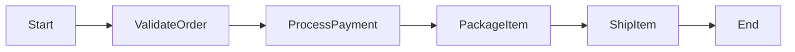
*Figure: Workflow-as-Context Pattern*

This pattern is used in business process management systems, ERP modules, and robotic process automation (RPA) — wherever enterprise-grade process visibility, auditing, and control are required.

##### Stateful Orchestration Pattern
The Stateful Orchestration Pattern ensures that agents retain memory of the current execution state across steps in a task or process. Rather than treating each action statelessly, the system maintains a session or workflow state to manage progression, retries, or user resumption. For example, a multi-page form assistant retains the user’s inputs across sessions. If the user exits midway, their progress is saved, and they resume later from the same point, avoiding duplication or loss of effort.


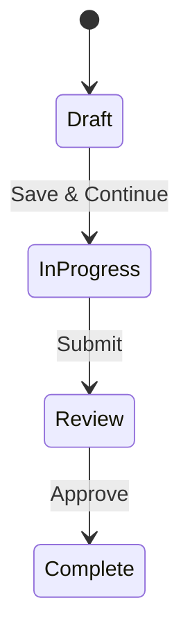
*Figure: Stateful Orchestration Pattern*

The typical use case for this pattern is document preparation bots, tax filing assistants, and onboarding workflows in SaaS platforms that frequently apply this pattern to preserve continuity in complex user interactions.

##### Checkpoint and Resume Pattern
The Checkpoint and Resume Pattern introduces strategic "save points" within long-running or failure-prone tasks. If an interruption or crash occurs, execution can resume from the last successful checkpoint rather than restarting from the beginning, improving efficiency and resilience. For example, during a data migration across systems, the pipeline checkpoints after each 10,000 records. If a failure occurs on batch 3, only batch 3 is reprocessed, not the entire job. 


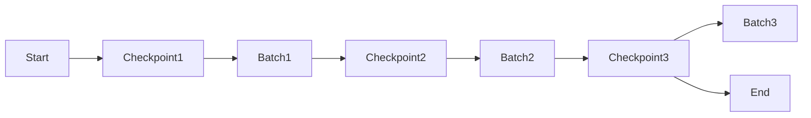
*Figure: Checkpoint and Resume Pattern*

This pattern is widely applicable in ETL pipelines, model training loops, and transactional processing agents where operation duration spans minutes or hours.

##### Exception Escalation Pattern
The Exception Escalation Pattern introduces structured fallback mechanisms. When a task fails or exceeds agent capability, the failure is automatically routed to a higher authority — typically a human or more capable agent — for resolution, retry, or override. For example, a billing bot fails to reconcile an invoice due to missing tax details. Instead of discarding the task, it escalates the case to a human accountant agent, preserving all logs and error details for faster triage.


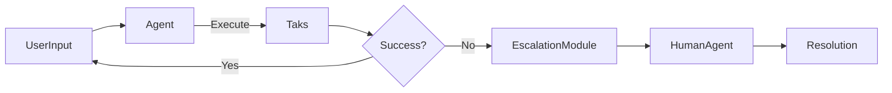
*Figure: Exception Escalation Pattern*

Financial operations, medical triage systems, legal document workflows, or any environment where risk or ambiguity must be managed carefully through escalation paths are common use cases for this pattern.

While process management patterns focus on the internal flow and state management of tasks, they often assume a predefined structure of agent behavior. However, how agents relate, organize, and collaborate in complex, adaptive systems becomes equally essential to ensure flexibility, resilience, and scalability. This leads us to the final category in our pattern taxonomy: Collaboration Patterns.

#### Collaboration Patterns
Collaboration patterns define the structural and organizational relationships among agents in a system. These patterns do not prescribe specific tasks or workflows, but instead model how agents relate to each other regarding control, communication, responsibility, and autonomy.

The patterns in this category range from singular control structures to loosely coupled swarms and legally bounded ecosystems. These models are foundational in designing agent collectives — whether in enterprise systems, federated networks, or multi-LLM orchestration.

The main patterns include:

- Singleton
- Team/Group
- Organization
- Swarms
- Ecosystem
- Legal Entity
- Federation
- Supply Chain

##### Singleton

The Singleton Pattern defines a collaboration model where a single agent is solely responsible for a specific goal or function within the system. This agent may act as an orchestrator, data steward, or controller, ensuring uniqueness and avoiding ambiguity in decision-making or execution. For example, a central deployment manager in a CI/CD pipeline coordinates all build and release tasks. No other agents initiate deployment — this role is singular, stable, and protected against duplication.


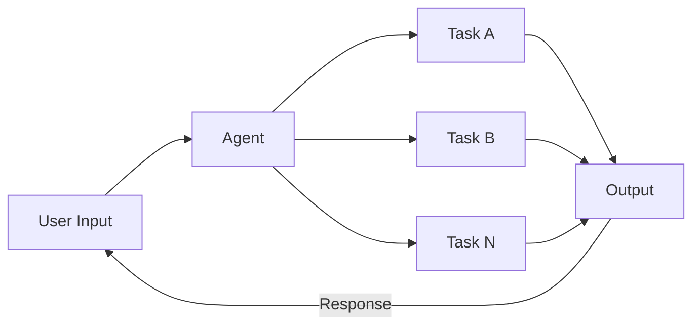
*Figure: Singleton Pattern*


This pattern suits scenarios where consistency and authoritative control are critical, such as master schedulers, central policy engines, or token issuers in identity systems.

#####  Team/Group Pattern
The Team/Group Pattern describes a collaboration model where several agents coordinate closely to execute a shared goal. Unlike the Singleton, which centralizes responsibility, the team model promotes peer-level collaboration, often with overlapping skills or redundant capabilities. For example, a customer support system may include a team of language-specific chatbots — one for English, another for Spanish, and a third for French — working together to resolve multilingual issues. If one bot fails or is overwhelmed, another steps in to help.


```mermaid
flowchart LR
    User --> P[Planner]
    P --> T[Task]
    T --> Agent1
    T --> Agent2
    T --> Agent3
    Agent1 & Agent2 & Agent3 --> SharedGoal

```
*Figure: Team/Group Pattern*

This pattern fits systems requiring resilience, collaboration, or fallback across agents with similar roles, such as AI pair programming assistants, medical triage teams, or distributed moderation bots.

##### Organization Pattern
The Organization Pattern formalizes agents into a structured hierarchy, with roles, responsibilities, and often governance rules that resemble traditional human organizations. Agents may report to others, escalate issues, or operate in functional silos. For example, in a corporate simulation, agents may represent roles such as manager, engineer, and compliance officer. Each agent operates with well-defined duties and interacts according to an internal reporting structure.


```mermaid
flowchart LR
    P[Primary Agent/CEO]
    P --> VP1[Secondary Agent - VP1]
    P --> VP2[Secondary Agent - VP2]
    VP1 --> T1[Tertiary Agent -EngineerA]
    VP2 --> T2[CTertiary Agent -ComplianceBot]
    T1 --> Ta1[Complete Task A]
    T2 --> Ta2[Complete Task B]
```
*Figure: Organization Pattern*

This pattern is ideal for modeling digital enterprises, inter-agent compliance systems, or multi-agent simulations where accountability, delegation, and policy adherence are essential.


##### Swarms Pattern
The Swarm Pattern describes an extensive, decentralized collection of agents that follow simple local rules, often resulting in emergent global behavior. No central controller exists; coordination emerges from interaction patterns and shared signals. For example, in a swarm-based delivery system, each drone independently makes routing decisions based on nearby traffic, battery level, and load. Yet collectively, the swarm achieves optimal coverage and efficiency.


```mermaid
flowchart LR
    Agent1 --> Signal
    Agent2 --> Signal
    Agent3 --> Signal
    Signal --> EmergentBehavior
```
*Figure: Swarms Pattern*

Swarms are especially useful in robotics, distributed search, or large-scale content moderation systems, where flexibility and scalability are paramount.

##### Ecosystem Pattern
The Ecosystem Pattern models agents as loosely coupled participants in a dynamic, modular environment. Agents are autonomous, may join or leave freely, and interact based on interests, contracts, or incentives rather than control. For example, an AI research platform offers tools, datasets, and APIs. Various agent systems plug into the platform to run experiments, contribute findings, or consume shared services, but no one agent controls the platform.


```mermaid 
flowchart LR
    Agent1 -->|Consumes| API
    Agent2 -->|Publishes| Data
    Agent3 -->|Collaborates| Toolset
    API & Data & Toolset --> EcosystemHub
```
*Figure: Ecosystem Pattern*


This pattern is ideal for developer platforms, decentralized app ecosystems, or agent marketplaces where modularity and autonomy are key.

##### Legal Entity Pattern
The Legal Entity Pattern models agents as representatives of distinct organizational or legal bodies, with formal agreements governing rights, obligations, and workflows. This pattern supports inter-entity collaboration, auditing, and compliance tracking. For example, a procurement workflow involves an internal finance agent, a third-party supplier agent, and a logistics agent. Each represents a different organization and interacts under a service-level agreement (SLA).


```mermaid
flowchart LR
    FinanceAgent["Company A"] -->|PO| SupplierAgent["Company B"]
    SupplierAgent --> LogisticsAgent["Company C"]
```
*Figure: Legal Entity Pattern*

This is key for intercompany transactions, B2B API integrations, or simulations involving legal, financial, or compliance-heavy agents.

##### Federation Pattern
The Federation Pattern describes a system where subgroups or clusters of agents operate autonomously but comply with shared governance protocols or standards. Each subset may be independently managed but aligns with federation rules. For example, multiple hospital agents train local models on private data in a federated learning system. These models are then aggregated into a central model without exposing raw data, preserving autonomy while achieving collective intelligence.


```mermaid
flowchart LR
    Subgroup1 --> GovernanceLayer
    Subgroup2 --> GovernanceLayer
    Subgroup3 --> GovernanceLayer
    GovernanceLayer --> SharedModel
```
*Figure: Federation Pattern*

This pattern is used in federated data systems, distributed governance platforms, or networked AI systems where privacy, sovereignty, or independence is necessary.

##### Supply Chain Pattern
The Supply Chain Pattern structures agent collaboration as a linear or branched sequence, where each agent contributes a value-added function to the end product or outcome. Each step is dependent on upstream inputs and feeds downstream processes. For example, in manufacturing, a design agent produces a blueprint, which a production agent consumes, then a QA agent, and finally a packaging agent.


```mermaid
flowchart LR
    DesignAgent --> ProductionAgent --> QAAgent --> PackagingAgent --> DeliveryAgent
```
*Figure: Supply Chain Pattern*

This pattern is ideal for manufacturing automation, document processing chains, or logistics systems with strict process sequencing and handoffs.

These Collaboration Patterns provide a foundational vocabulary for designing intelligent agent systems that are functionally capable and structurally coherent. Whether the system demands a tightly controlled singleton, an adaptive swarm, or a modular, contract-based ecosystem, each pattern offers a blueprint for aligning agent interactions with real-world organizational needs. By combining these collaboration models with the earlier layers of coordination, task decomposition, and process management, architects and engineers can construct agent ecosystems that are scalable, resilient, and purposefully aligned with both technical and human-centric goals.
