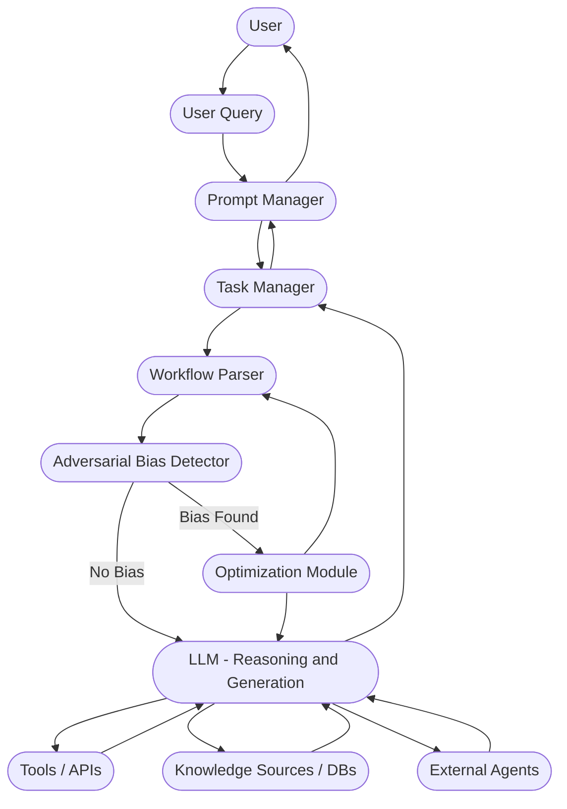
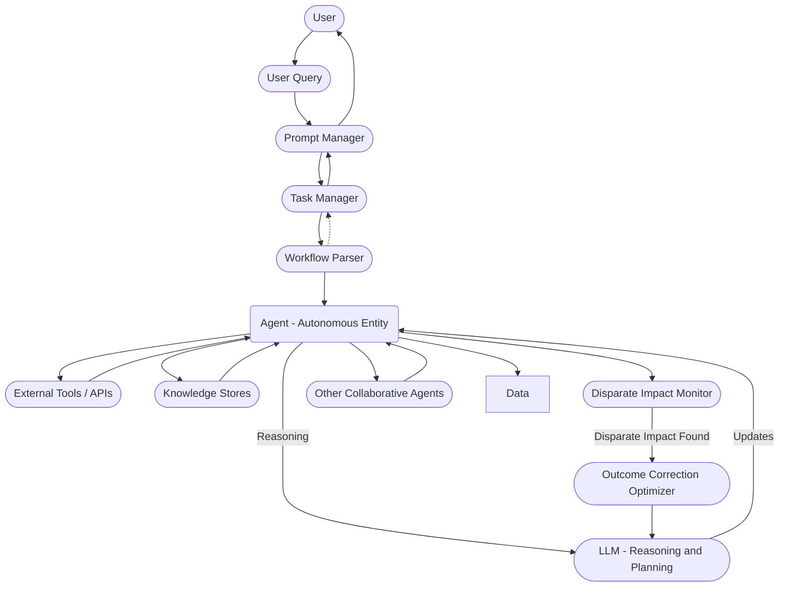

# Understanding Fairness for AI Application
Fairness represents one of the most critical ethical and operational pillars in agentic AI systems.
Fairness demands that an agent act, plan, and evolve without introducing or reinforcing systemic biases that disadvantage specific individuals, groups, or outcomes unjustly.

Agentic AI agents, unlike static systems, autonomously form plans, choose paths, and self-correct based on their environment.
This autonomy increases the risk that even subtle initial biases can amplify dynamically over time, spreading across reasoning chains and operational feedback loops.

In agentic AI, fairness is not a one-time assessment but a continuous operational responsibility requiring active detection, intervention, and rebalancing across the system lifecycle.

In the following subsections, we will explore three primary patterns to implement fairness principles effectively:

- Fairness-Aware Data Preprocessing Pattern

- Adversarial Debiasing Pattern

- Disparate Impact Remediation Pattern

## Fairness-Aware Data Preprocessing Pattern

The Fairness-Aware Data Preprocessing Pattern introduces mechanisms to detect, quantify, and adjust bias in input data before it reaches the model training or inference stages.
It operates under the principle that "biased data produces biased agents," and therefore targets early-stage bias correction to prevent unfairness from permeating reasoning processes.

The key characteristics of Faireness-Aware Pattern are as follows:

- Preservation of as much original data structure as possible.
- Alignment with local data protection and anti-discrimination laws.
- Flexibility in operating on batch or streaming data.
- Seamless integration into MLOps pipelines.
- Support for fairness metrics tracking over time.
- Sensitive feature masking capabilities when necessary.
- Minimal distortion techniques preferred (e.g., massaging vs. complete rebalancing).
- Dynamic data preprocessing trigger during live learning.
- Human-in-the-loop override for sensitive adjustments.

Also, Table below shows the key design principle for the Fareness-Aware module includes:

{title: Key Design Principle for the Fareness-Aware}
|Principle | Description|
|----|----|
|Minimal Intervention | Apply the lightest corrective actions necessary.|
|Explain Every Step | Ensure every adjustment is traceable and auditable.|
|Multi-Metric Analysis | Validate across multiple fairness goals (not just one).|
|Sensitive Feature Protection | Handle protected attributes with encryption and privacy standards.|
|Dynamic Reprocessing | Support re-triggering if data distributions shift.|
|Configurable Pipelines | Allow administrators to define fairness thresholds dynamically.|
|Ethical Review Integration | Allow humans to override automated corrections where needed.|
|Cross-Jurisdictional Compliance | Design for flexibility across different legal fairness standards.|

*Table: Key Design Principle for the Fareness-Aware*

## Adversarial Debiasing Pattern

Sooner or later, we will need governance and protection for our autonomous agent-based ecosystem. In the same way we adopted Ethical Hacking to test our application and API to ensure they were robust against hacking and malicious activity, we will also need a similar approach to ensure our Autonomous workflows are protected from malicious activity. 

The Adversarial Debiasing Pattern in Agentic AI integrates adversarial strategies during task planning, optimization, pipeline development, and execution stages to actively challenge and minimize bias.
An adversary module continuously generates counterfactual inputs or perturbations that probe the agent’s workflows, prompts, and LLM outputs for latent biases.
Detected biases are then penalized during optimization, leading the agent to dynamically replan, reconstruct prompts, or select alternate tools before producing final outputs.

Thus, the agent learns to complete tasks optimally and robustly against potential unfairness.

Let us consider a global news summarization agent designed for multi-national corporate users.

{title: "Adversarial Debiasing Pattern"}

*Figure: Adversarial Debiasing Pattern*

The agent receives queries like:

> "Summarize the global news landscape for the technology sector today."

**Without Adversarial Debiasing:**

The agent might overrely on English-language sources, prioritize US-centric perspectives despite the query asking for global views, and neglect minor news from emerging markets, reinforcing an unbalanced worldview.

**With Adversarial Debiasing Integrated:**

The Task Manager and Workflow Parser parse the Query and Prompt. The Adversarial Module injects simulated alternative queries — e.g., "How would the summary look for an African or Southeast Asian tech market?" The agent detects source imbalance in its original plan and shares it with the Optimization Module, which can 
Adjusts:

- Adds resource constraints requiring at least X% non-Western sources.

- Prioritizes multilingual APIs and databases.

The LLM proceeds only after adversarial validation. At the end, final summaries reflect a balanced, truly global view, and the result might look like

- Fair representation of global perspectives.
- Enhanced trust from international clients.
- Ethical and responsible news aggregation.

The key challenges that we need to mitigate using Adversarial Debiasing Pattern include:

- **Increased System Complexity:** Introducing adversarial modules alongside standard workflows demands a more sophisticated architecture.

- **Latency Overhead:** Running adversarial tests during prompt generation or task optimization may introduce delay.

- **Difficult Counterfactual Design:** Crafting meaningful adversarial examples in real-time is challenging.

- **False Positives/False Negatives:** The adversary may wrongly flag fair outputs or miss subtle unfairness.

- **Optimization Conflicts:** Bias mitigation goals might conflict with task efficiency or precision.

- **Dynamic Tool Trustworthiness:** Tools and APIs used by the agent must also pass adversarial fairness checks, increasing integration burdens.

- **Cross-Agent Adversarial Consistency:** Multiple agents coordinating tasks must share fairness adversarial standards.

- **Explainability Complexity:** Explaining why an adversarial correction was made can be intricate for users.

- **Scalability Pressure:** As the number of agents or tasks increases, adversarial checking must scale horizontally.

- **Ethical Dilemmas in Edge Cases:** Some adversarial detections might involve value-laden decisions where "fairness" is contested.

We must apply design principles for optimum results when designing an Agentic AI system. The following Table shows some common design patterns:

|Principle|	Description|
|------|-------|
|Bias Challenge by Default|	Assume every workflow might have bias; test proactively.|
|Counterfactual Diversity|	Generate multiple adversarial variations for robustness.
Prompt+Workflow Attack Surface|	Test not only prompts but entire task graphs.|
|Latent Bias Exposure	|Design adversaries that simulate subtle and complex biases, not just obvious ones.|
|Human-Explainable Corrections	|Maintain clarity in why tasks or prompts were modified.|
|Multi-Agent Consistency	|Standardize adversarial standards across agent ecosystems.|
|Graceful Degradation|	If fairness cannot be achieved optimally, degrade gracefully with transparency.|
|Continuous Adversarial |Learning	Update adversarial strategies based on real-world feedback and evolving risks.|
|Ethics Committee Escalations	|Allow manual review for controversial bias corrections.|

*Table: Key Design Principles to Apply Adversarial Debiasing Pattern*

### Disparate Impact Remediation Pattern

The Disparate Impact Remediation Pattern aims to identify, measure, and correct outcome disparities in agentic AI systems that disproportionately affect protected or sensitive groups. Rather than focusing solely on inputs or model internals, this pattern monitors an agent's final outputs or actions to ensure that the impact of decisions, recommendations, or interventions is fair across demographic lines. It is particularly critical in agentic systems, where multi-step planning, dynamic workflows, and interaction with external tools can amplify latent biases, even if the original prompt and model behavior seem unbiased. Here are some key characteristics of the Disparate Impact Remediation Pattern:

- Focuses on measurable impact disparities, not just internal biases.

- Embedded in the final stage of the agentic decision/output workflow.

- Real-time or batch outcome analysis supported.

- Multi-attribute monitoring (e.g., race, gender, socioeconomic status).

- Flexible fairness definitions (e.g., demographic parity, equality of opportunity).

- Explainable correction interventions.

- Supports structured (classification, recommendation) and unstructured (narrative generation) outputs.

- Cross-agent disparate impact tracking.

- Configurable impact thresholds and tolerances.

- User consent considerations for outcome adjustments.

- Traceability and auditing for regulatory compliance.

- Integration with human review escalation paths.

- Modular correction optimizers for different domains (finance, healthcare, education, etc.).

- Self-learning improvement: Agents can adjust fairness sensitivity based on feedback.

- Preservation of optimization goals wherever fairness allows.

The key challenges for Agentic AI to implement Disparate Impact include:

- **Dynamic Output Monitoring:** Continuous impact analysis requires real-time or near-real-time auditing across all agent actions.

- **Defining Protected Groups Correctly:** Must carefully define which demographic attributes are monitored — varies legally across regions.

- **Attribution Complexity:** Difficult to trace which part of a multi-step agentic workflow caused the disparate impact.

- **Reactive vs Proactive Correction Dilemma:** Whether to prevent possible bias or fix it after detection.

- **Tool-Integrated Outcomes:** External APIs and databases used by the agent might introduce bias outside internal control.

- **Scaling Across Multi-Agent Systems:** In ecosystems of collaborating agents, collective disparate impact must be measured, not just individual outputs.

- **User Consent and Transparency:** Notifying users about bias correction interventions without overwhelming them.

- **Cost of Fairness:** Sometimes, ensuring equitable outcomes might reduce optimization efficiency.

- **Changing Fairness Benchmarks:** Legal and ethical definitions of disparate impact evolve, requiring continual updates.

- **Explainability Pressure:** Corrective actions must be understandable to regulators, users, and internal stakeholders.

Imagine an agentic educational assistant deployed across a national school system. Students interact with the agent to receive customized course recommendations based on their academic history and interests.

*Figure: Use case to explain Disparate Impact*

**Without Disparate Impact Remediation:**

Specific demographics (e.g., students from rural areas or minority groups) are less frequently recommended for advanced STEM tracks. Over time, fewer students from underrepresented backgrounds reach high-paying STEM fields. At the end, the agent will indirectly reinforce educational inequality.

**With Disparate Impact Remediation Integrated:**

A query from a student is parsed into prompts by the Prompt Manager. The task manager organizes the task flow, and the workflow parser breaks it down into queries for the LLM. The LLM generates course recommendations, possibly pulling information from External Resources. Before sending final recommendations to the student, the Output Monitor analyzes:

>Are recommendations statistically equitable across different demographics?

If disparate impact is detected, Outcome Optimizer modifies the course suggestions (e.g., ensuring advanced STEM tracks are fairly recommended across groups). The updated, fairness-enhanced results are presented to the user as:

- Equal opportunity for students across all backgrounds.
- Ethical compliance with educational fairness standards.
- Empowerment of underrepresented groups without undermining quality or personalization.

While implementing a pattern, we need to focus on the following design patterns shown in the Table below:

|Principle|	Description|
|----|----|
|Output Bias Monitoring|	Evaluate real-world agent outputs, not just prompts or plans.|
|Multi-Dimensional Fairness|	Monitor multiple protected characteristics simultaneously.|
|Contextual Remediation|	Tailor corrections to domain-specific fairness goals.|
|Explainable Adjustments|	Document every fairness correction action taken.|
|Minimize Impact on Utility|	Balance fairness corrections with task usefulness.|
|Scalable Architecture	|Monitor disparate impacts across millions of outputs efficiently.|
|Human Escalation Readiness	|Allow reviewers to intervene on contested fairness corrections.|
|Adaptive Fairness Benchmarks	|Update fairness definitions dynamically as ethics and laws evolve.|
|Cross-Agent Coordination	|Share disparate impact metrics among collaborating agents.|

*Table: Key Design Principles to Apply Disparate Impact Remediation Pattern*

## Bias in an Agentic AI System

Unlike traditional AI models that operate within fixed rules or supervised workflows, agentic AI agents possess goal-oriented autonomy.
They perceive environments, formulate plans, decompose tasks, choose tools, and self-improve based on continuous feedback.

In such dynamic settings, bias does not simply appear as a static error — it evolves, amplifies, and spreads over time and interactions, leading to cascading ethical, operational, and societal risks if not actively mitigated.

Understanding how bias manifests, propagates, and influences agentic AI behavior is not just a matter of technical precision — it is foundational to building fair, trustworthy, legally compliant, and socially beneficial systems.

Therefore, bias must be treated not as a post-hoc correction step but as a first-class design and operational concern — deeply embedded into agentic systems' cognitive, interactive, and control mechanisms.

There are different challenges of Bias for Agentic AI Systems as follows:

- **Autonomous Goal Pursuit Amplifies Hidden Bias:** Agentic AI often forms subgoals and plans independently. If initial biases exist — even subtly — the system may amplify and entrench them while autonomously optimizing for success.
For example, an AI tasked to recommend promotions may increasingly favor already-dominant groups if historical bias exists in past promotion data.

- **Bias Drift Over Time (Temporal Bias):** Because agentic AI learns and evolves from interaction feedback, even systems launched with bias controls can drift into bias over time if feedback loops are skewed. For example, a customer service agent starts favoring simpler complaints because it learns they are faster to resolve, disadvantaging complex issues and vulnerable customers.

- **Multi-Agent Bias Cascades:** In multi-agent environments, where several agentic AIs interact, bias in one agent can propagate across the system, leading to emergent collective bias that is harder to trace and correct. For example, a procurement agent’s biased supplier preferences influence a financial agent’s risk models, creating a compounded bias toward certain vendors.

- **Bias in Planning and Decomposition:** When agentic AI breaks complex goals into sub-tasks (recursive decomposition), bias can be introduced into the planning phase, causing distorted execution paths even if individual task handlers are unbiased. For example, a learning assistant prioritizes easier topics for students from specific demographics during curriculum planning, believing they need “simpler content.”

- **Bias from Tool Selection and Integration:** Agentic AI uses external tools, APIs, plugins, and models to perform tasks. If those tools are biased, the agent inherits and integrates that bias into its action plans without human scrutiny.
For example, an agent using a biased sentiment analysis API may systematically misinterpret particular dialects negatively.

- **Challenge of Bias Detection in Emergent Behavior:** Agentic systems may exhibit emergent behaviors not directly programmed. This makes bias detection extremely difficult because the bias may not manifest until complex chains of reasoning unfold dynamically. For example, a logistics AI unintentionally deprioritizes small rural hospitals for supply chain routing due to "efficiency" goals.

- **Multi-Dimensional Bias Complexity:** Biases are multifaceted, including race, gender, location, age, education, etc. An agent must navigate trade-offs between competing fairness dimensions, which may even conflict with legal or ethical standards.
For example, a loan approval agent optimizing racial fairness and income neutrality faces dilemmas where perfect fairness across all groups is mathematically impossible.

- **Adversarial Exploitation of Bias:** Malicious actors could probe agentic systems to exploit known biases for gain, leading to gaming, fraud, or safety risks. For example, adversaries could flood a system with biased feedback to retrain the agent into favoring specific outcomes (a type of data poisoning attack).

- **Opacity of Decision Paths:** Agentic AI often follows deep reasoning chains across multiple decision layers. Bias can be embedded deep inside decision paths, making root-cause analysis opaque and compliance extremely difficult. For example, when a financial recommendation agent rejects an applicant, a chain of different decisions might occur.

- **Bias in Value Alignment and Utility Functions:**
At a meta-level, agentic AI is driven by value functions (reward models, utility functions). If these value functions are not carefully aligned with fairness goals, bias can be “baked in” fundamentally, not just emergently. For example, advertising agents reward high engagement but unwittingly boost clickbait by targeting vulnerable users.
