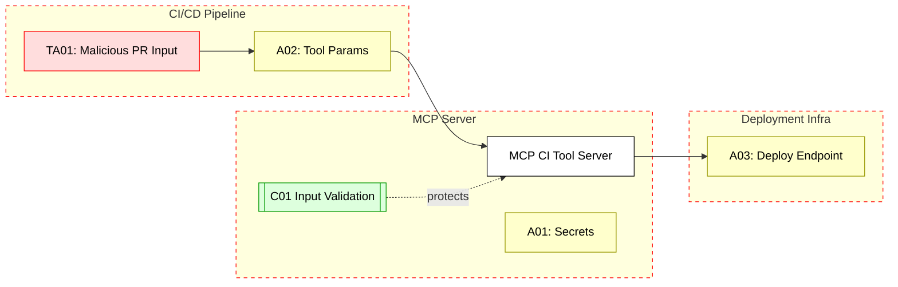

## Scenario:
An enterprise integrates MCP servers into its CI/CD pipeline to allow AI agents to trigger test suites, deploy previews, and generate reports. These MCP tool invocations receive environment context — such as build branch, commit SHA, deployment tokens, etc. — as part of their tool parameters.

A compromised developer (or malicious PR author) poisons the build context with a fake commit SHA or a dangerous token in an environment variable. This gets passed to the MCP server and used to invoke sensitive tools, potentially leaking secrets or triggering deployments with spoofed metadata.

## Threat Landscape:
CI/CD environments are highly dynamic and often trust variables injected at runtime. If build inputs are not validated before tool invocation, attackers can control tool execution context. This can lead to privilege escalation or misuse of internal tools (e.g., deploying unapproved code, accessing debug logs).

## Assets (A):
* A01: Build secrets (e.g., deployment tokens, S3 keys).
* A02: Tool parameters (e.g., branch, repo info).
* A03: Internal test/deploy endpoints.

## Threat Actors (TA):
* TA01: Malicious PR author crafting fake metadata.
* TA02: Compromised developer modifying build scripts.

## Security Controls (C):
* C01: Sanitize and validate all dynamic inputs passed to MCP tools.
* C02: Sign and verify trusted metadata (e.g., SHA, repo).
* C03: Run MCP in a sandboxed CI step with read-only permissions.

## Zones:
* CI/CD Pipeline
* MCP Server
* Deployment Infrastructure

