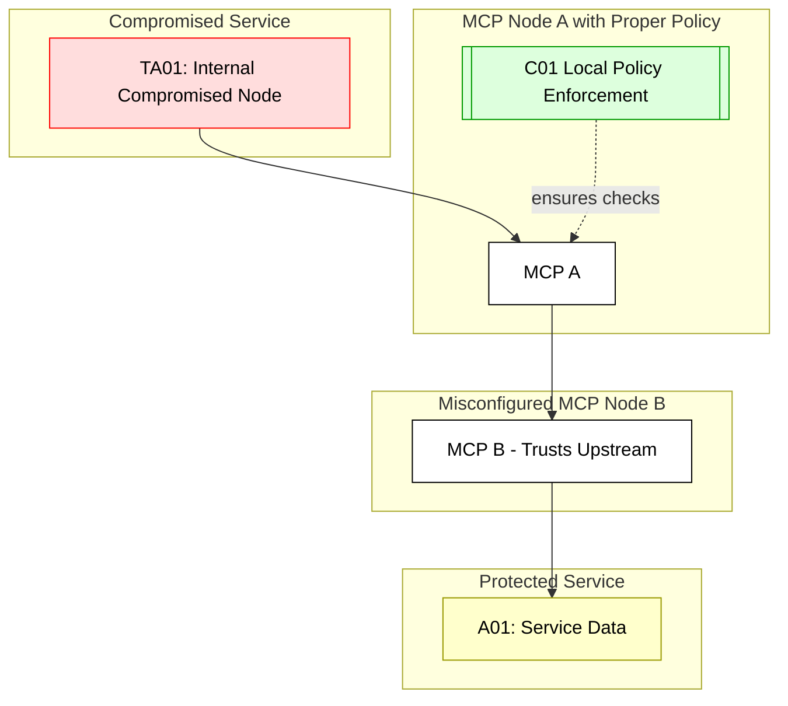

## Scenario:
In a microservices architecture, MCP is used as a mesh router between services, translating tool invocations from one microservice to another. Policies for access (e.g., namespace-level RBAC) are enforced at each MCP edge.

However, one MCP node is misconfigured to trust upstream requests and skips policy evaluation, assuming enforcement was done at the source. This opens the door to lateral movement, where a compromised service can issue tool calls across services without proper checks.

## Threat Landscape:
Trust between internal services is often implicit in mesh networks. A misconfigured node can allow cross-namespace access, effectively bypassing RBAC or ABAC policies due to trust downgrade. It’s a classic case of confused internal trust.

## Assets (A):
* A01: Microservice data in protected namespaces.
* A02: Policy configurations enforced at edge.
* A03: Service account identities.

## Threat Actors (TA):
* TA01: Compromised service instance making unauthorized tool calls.
* TA02: Internal attacker moving laterally.

## Security Controls (C):
* C01: Enforce policies on every MCP node, not just ingress.
* C02: Include identity headers and verify authenticity at each hop.
* C03: Use signed JWTs or mTLS to confirm tool call provenance.

## Zones:
* Internal Services (microservices)
* MCP Mesh (per-node policy enforcement)
* Data Stores (final target)

