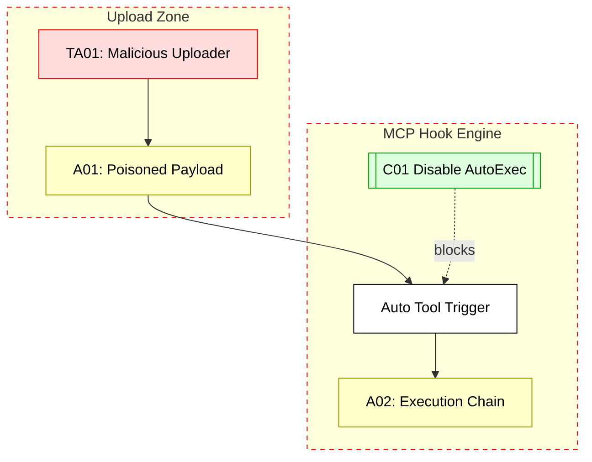

## Scenario:
MCP is configured to auto-execute certain tools (e.g., on message received or file uploaded) using webhooks or triggers. A user uploads a poisoned file that causes the MCP to invoke an external webhook, passing that file as a parameter.

The payload contains a link or embedded code that causes the triggered tool to send itself to other systems, creating a worm-like propagation pattern within MCP-connected systems.

## Threat Landscape:
Wormable attacks exploit auto-invocation and unvalidated content flows. Since MCP can call arbitrary tools with uploaded inputs, any loop or trigger chain that allows execution from user input is dangerous.

## Assets (A):
* A01: File input or webhook parameter
* A02: Triggered tool execution chain
* A03: Internal outbound tools or comms

## Threat Actors (TA):
* TA01: User uploading malicious file
* TA02: Internal trigger that propagates the attack

## Security Controls (C):
* C01: Disable auto-triggered tool calls on user input
* C02: Sanitize file content and parameters
* C03: Monitor repeated tool call patterns from single trigger

## Zones:
* User Input (uploads)
* MCP Trigger Logic
* Target Tools/Webhooks

