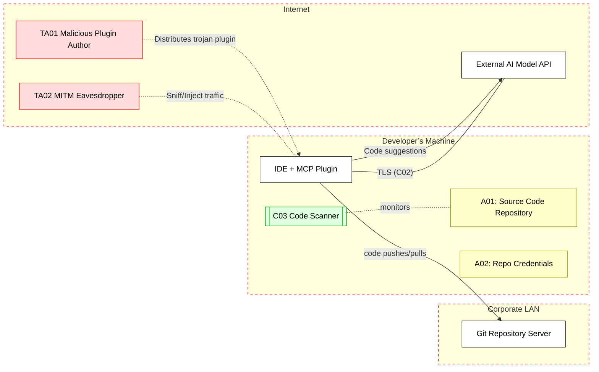

## Scenario 
A software developer uses an IDE plugin powered by an MCP server for code suggestions and refactoring assistance. The MCP server runs on the developer’s machine, exposing local development assets (code files, repository access) to an AI assistant. The IDE (MCP client) communicates with either a local model or a cloud AI API for generating code completions.
Threat Landscape: In this setup, threats include malicious code injection via the AI assistant (if an attacker compromised the plugin or prompt context), leakage of proprietary source code to external parties, or unauthorized repository access. A compromised or trojanized MCP plugin could exfiltrate code or credentials. Network eavesdroppers could hijack traffic if communications (to AI APIs or git servers) are not encrypted. The developer’s machine becomes an attack surface through the MCP channel.
## Assets (A):
- A01: Proprietary source code (the project files/repository content in the IDE) – valuable intellectual property.
- A02: Developer’s credentials (SSH keys, access tokens for code repo or API) stored for tool access.
## Threat Actors (TA):
- TA01: Malicious plugin or extension author (attacker distributes a compromised MCP plugin that executes unauthorized commands
[techcommunity.microsoft.com](https://techcommunity.microsoft.com/blog/microsoftdefendercloudblog/plug-play-and-prey-the-security-risks-of-the-model-context-protocol/4410829#:~:text=MCP%E2%80%99s%20absence%20of%20robust%20authentication,credentials%2C%20leading%20to%20potential%20breaches)
).
- TA02: Network eavesdropper on the LAN/Internet (capable of sniffing or tampering with MCP traffic if not secured).
## Security Controls (C):
- C01: Trusted plugin sources & code signing – ensure the MCP plugin is vetted and signed to prevent rogue code.
- C02: TLS encryption on all MCP communications with external services (e.g. AI API calls) to thwart MITM eavesdropping.
- C03: Sandbox and monitoring – restrict the plugin’s file/system access and use static code scans or runtime monitoring to detect any malicious operations on code (e.g. unauthorized file exfiltration).
## Zones:
- Developer Machine (IDE environment – trusted internal zone)
- Corporate LAN (enterprise network with code repository server)
- Internet (external AI API or plugin source – untrusted zone)

