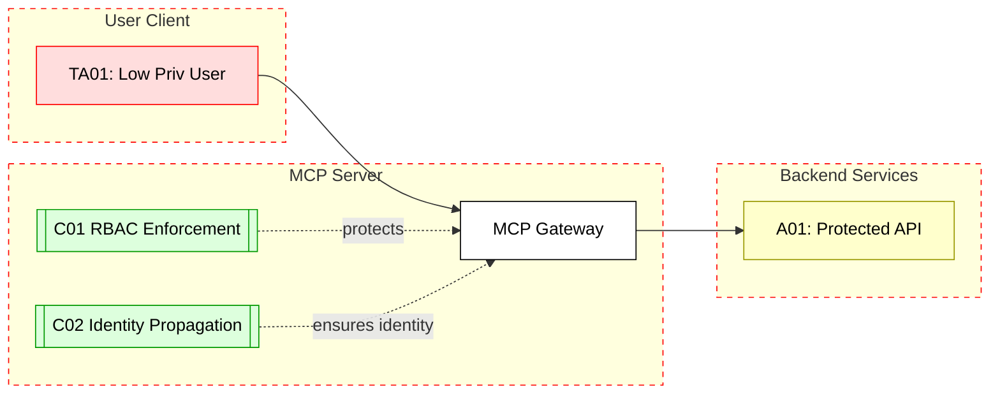

## Scenario:
An MCP server is deployed in front of a backend application as an API proxy. It provides a common abstraction layer to multiple backend services (e.g., billing, user info, notifications). It maps tool calls from the LLM to the appropriate internal APIs based on namespaces or tool names. 

However, the MCP’s authentication logic doesn’t propagate or enforce backend authorization correctly. A user with access to one tool (e.g., `get_user_profile`) can manually craft a tool call to another internal API (e.g., `delete_account`) by modifying the request payload, bypassing RBAC checks.

## Threat Landscape:
Because MCP abstracts backend services and translates tool calls into HTTP requests, weak input validation or improper auth propagation can allow privilege escalation. This is especially dangerous if the backend services trust the MCP blindly.

## Assets (A):
* A01: Backend APIs (user data, account control).
* A02: User credentials and role mappings.
* A03: Internal service tokens used by MCP.

## Threat Actors (TA):
* TA01: Authenticated user with low privileges.
* TA02: Internal user trying to escalate scope.

## Security Controls (C):
* C01: Enforce RBAC at MCP layer before invoking any backend API.
* C02: Use per-user tokens and propagate identities correctly.
* C03: Log and audit all tool-to-API translations for anomalies.

## Zones:
* User (authenticated LLM user)
* MCP Gateway
* Backend Services

