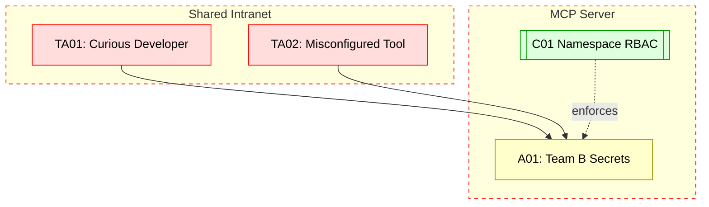

## Scenario:
A shared internal MCP server is deployed on an enterprise intranet. Teams use it for automation (e.g., tool calls for managing test VMs, secrets, or deployments). There’s no strict per-namespace RBAC, so a user from Team A can see tools from Team B.

A curious or malicious developer from Team A calls “fetch_test_log(team=B)” or “get_secret_keys(namespace=B)” and retrieves data they shouldn’t access.

## Threat Landscape:
When namespaces aren’t isolated and RBAC is weak, accidental or intentional misuse becomes trivial. Internal threat actors exploit assumptions of trust in shared environments.

## Assets (A):
* A01: Cross-team secrets, logs, or infra details.
* A02: Tool invocation results for restricted namespaces.

## Threat Actors (TA):
* TA01: Internal developer or tester.
* TA02: Misconfigured internal tool.

## Security Controls (C):
* C01: Enforce namespace-scoped RBAC per user/team.
* C02: Token scoping – issue different tokens per team.
* C03: Redact logs containing other team data.

## Zones:
* Internal Users (trusted but unisolated)
* MCP Server
* Team Resources

