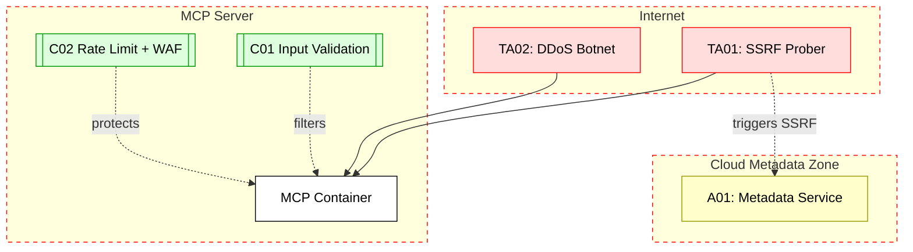

## Scenario:
An MCP server is deployed in a production environment using Docker and exposed to the internet on a public IP. The server is configured with several tools that allow AI agents to make HTTP requests (e.g., fetch data, crawl URLs, test APIs). Some of these tools accept unvalidated user input such as target URLs or payloads.

An attacker finds the endpoint and repeatedly invokes tools with malicious payloads – launching a denial-of-service attack, or using SSRF to probe internal metadata servers or cloud services (e.g., `http://169.254.169.254` on AWS).

## Threat Landscape:
MCP servers are attractive targets due to their high privilege and flexible tool invocation. Poorly validated inputs passed to internal request tools can lead to open SSRF vectors, and public exposure allows mass scanning. Lack of rate limiting or access control exacerbates the damage.

## Assets (A):
* A01: Internal metadata service (e.g., cloud tokens, instance info).
* A02: Availability of MCP server and tools.
* A03: Underlying infrastructure/network configuration.

## Threat Actors (TA):
* TA01: External attacker probing for SSRF.
* TA02: Botnet launching DDoS on open MCP endpoints.

## Security Controls (C):
* C01: Input validation + allowlisting of URLs.
* C02: Use reverse proxies with rate limiting and WAF rules.
* C03: Block internal IP ranges in HTTP tools.
* C04: Never expose internal MCP endpoints directly to the public internet.

## Zones:
* Public Internet (untrusted)
* MCP Server (containerized)
* Internal Cloud Network (with metadata endpoints)

