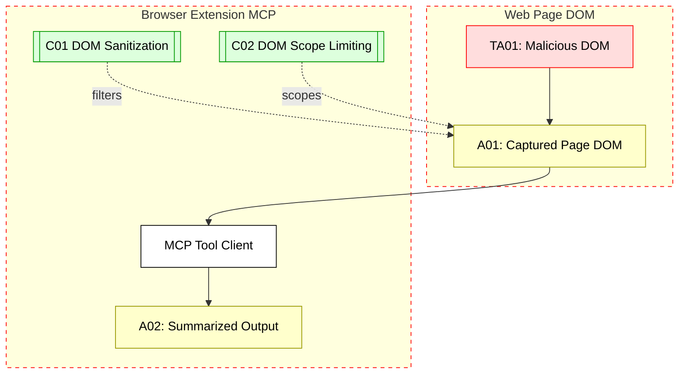

## Scenario:
A lightweight MCP client is bundled within a browser extension for AI-enhanced search and web summarization. The extension exposes a popup UI where users ask questions, and it invokes tools via the embedded MCP server. This MCP server can access the current page’s DOM for contextual input, which it sends to summarization tools.

A malicious web page injects dangerous DOM elements (e.g., `<script>` or misleading text) that get captured and submitted to the MCP. The summarization tool is then tricked into returning misleading or manipulated summaries — or worse, the output is copied into downstream automation with harmful effects.

## Threat Landscape:
DOM-based MCP tools, especially in extensions, are vulnerable to injection or misleading data poisoning. Because the LLM may treat the DOM as trusted context, attackers can hide payloads in iframes, offscreen elements, or invisible text that manipulates the model's behavior.

## Assets (A):
* A01: DOM data captured by the extension.
* A02: Summarized or transformed result shown to user or app.
* A03: Local MCP logic in the extension.

## Threat Actors (TA):
* TA01: Malicious website crafting misleading or hidden DOM content.
* TA02: User with manipulated input trying to trick downstream AI output.

## Security Controls (C):
* C01: Sanitize DOM input before sending to tools.
* C02: Limit which DOM elements are processed (e.g., visible text only).
* C03: Show preview of DOM input to users before tool is invoked.

## Zones:
* Browser DOM (untrusted)
* Browser Extension (semi-trusted)
* MCP Tool Invocation (inside extension or background script)

