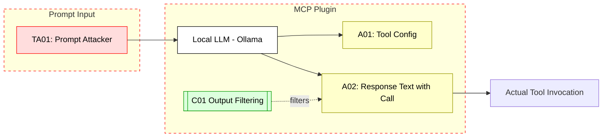

## Scenario:
An MCP plugin integrates with a local LLM like Ollama or LMStudio to generate responses from private tools. The tool passes raw user inputs to the model, and the model is not sandboxed or validated. A prompt injection modifies the tool’s instructions to bypass restrictions, invoke hidden tools, or exfiltrate data via response tokens.

This attack allows privilege escalation or leaking internal tool config even when the AI runs locally.

## Threat Landscape:
Local models offer speed and control, but they lack hardened isolation or content filtering. If user input is passed without sandboxing or output filtering, LLMs can hallucinate tool names, synthesize requests to fake endpoints, or leak sensitive instructions.

## Assets (A):
* A01: Internal tool instructions or config.
* A02: LLM-generated tool calls or text.
* A03: Response logs stored for auditing.

## Threat Actors (TA):
* TA01: Prompt attacker chaining local model with crafted input.
* TA02: Rogue user testing jailbreaks on local model.

## Security Controls (C):
* C01: Output filtering before executing tool calls.
* C02: Context chunking and isolation.
* C03: Do not serialize LLM outputs directly into tool requests.

## Zones:
* Local LLM Runtime
* MCP Server
* Tools or File System

