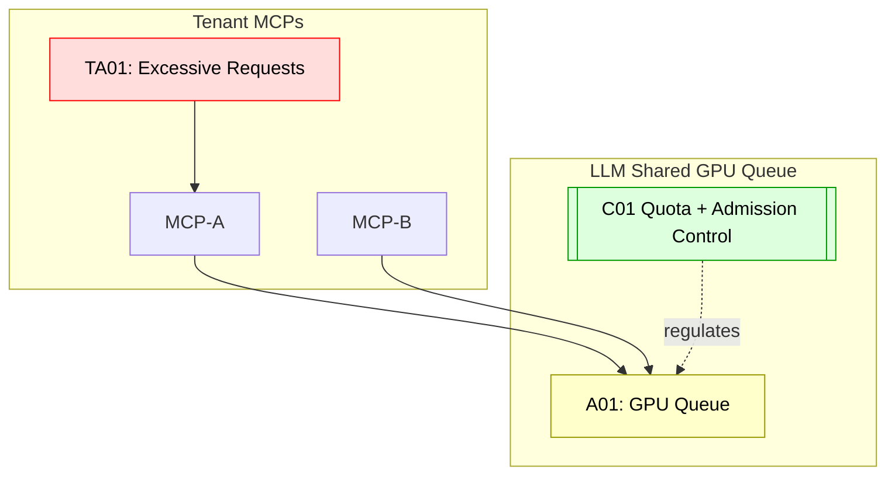

## Scenario:
An enterprise deploys multiple MCP servers for different product lines, all sharing the same GPU-based LLM backend. Each MCP invokes tools that execute long-running tasks or prompt generations. Due to lack of quotas or scheduling policies, one team launches a flood of long-running jobs that starve the GPU queue for others.

This causes SLA violations and disrupts time-sensitive operations from other MCP services, resulting in downtime or degraded responses.

## Threat Landscape:
LLM inference infrastructure is expensive and shared. When multiple MCP servers interact with the same LLM backend, without isolation or quotas, a single tenant can cause resource starvation, affecting others' quality of service (QoS).

## Assets (A):
* A01: LLM backend GPU queue.
* A02: SLA performance guarantees.
* A03: Time-sensitive downstream tool flows.

## Threat Actors (TA):
* TA01: Overactive team or automated agent flooding requests.
* TA02: Misconfigured retry logic amplifying load.

## Security Controls (C):
* C01: Implement per-tenant quota and rate limiting at MCP gateway.
* C02: Use token buckets or queue admission controls on LLM side.
* C03: Monitor tool latency and trigger circuit breakers on overload.

## Zones:
* Tenant MCP Servers
* LLM Backend (shared GPU queue)
* Monitoring / Quota Control

