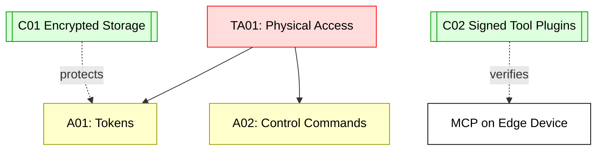

## Scenario:
An MCP server is embedded on a factory floor IoT gateway, used to control robot status, temperature, and predictive maintenance tools. The device is on a local network and uses bearer tokens to authenticate engineers or AI controllers. Physical access to the device enables attackers to read token files, alter MCP config, or extract environment secrets.

## Threat Landscape:
Edge devices often lack TPMs or secure enclaves. If an attacker gains local USB or UART access, they can fully dump storage and impersonate the MCP or inject new tool behavior. If the MCP is responsible for controlling physical systems, this leads to real-world impact.

## Assets (A):
* A01: Environment tokens and service credentials.
* A02: Control commands issued by MCP.
* A03: Network trust relationships.

## Threat Actors (TA):
* TA01: Physical attacker with access to device.
* TA02: Internal operator with elevated access.

## Security Controls (C):
* C01: Encrypt local storage with hardware modules.
* C02: Sign and verify tool plugins.
* C03: Monitor for unexpected tool config changes.

## Zones:
* Edge Device (IoT)
* MCP Runtime
* Industrial Network (robot, sensors)

