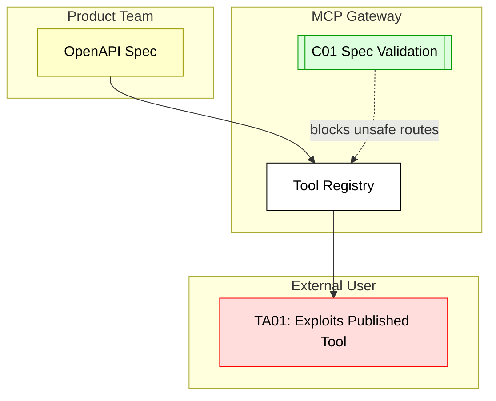

## Scenario:
An MCP Gateway loads OpenAPI specs dynamically from product teams and exposes their endpoints as tools. A product team accidentally publishes a version of their spec where an internal tool (e.g., `delete_all_users`) is not excluded from routing rules and is tagged as public. This gets picked up and becomes available to external users.

## Threat Landscape:
Tool generation from OpenAPI is powerful but risky when specs are misconfigured. Over-permissive routes, missing exclusions, or incorrect tags can expose privileged APIs to LLM users, bypassing traditional frontend protections.

## Assets (A):
* A01: Internal-only API endpoints.
* A02: User privilege and scope enforcement logic.
* A03: OpenAPI spec used to register tools.

## Threat Actors (TA):
* TA01: External user with MCP chat access.
* TA02: LLM agent misusing privileged tool in workflow.

## Security Controls (C):
* C01: Validate specs before importing into MCP (e.g., linter or allowlist).
* C02: Maintain per-namespace tool visibility mapping.
* C03: Auto-fail openAPI load if critical exclusions are missing.

## Zones:
* Product Team (publishes spec)
* MCP Gateway (loads spec)
* External User

