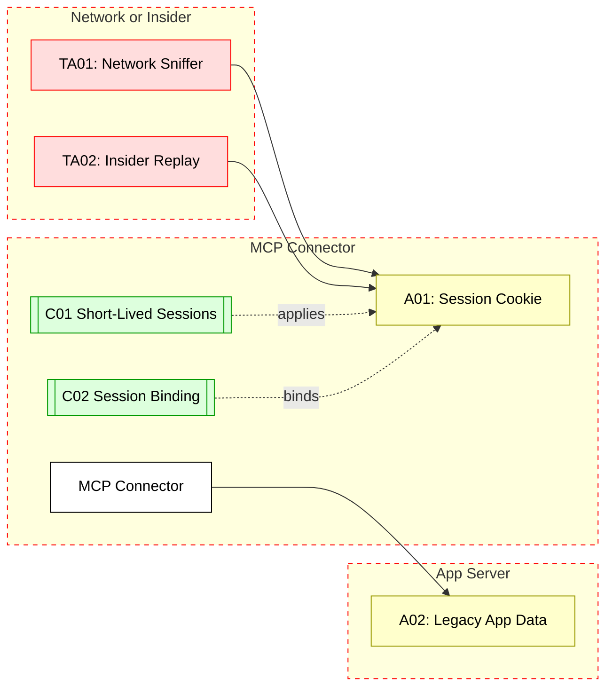

## Scenario:
An MCP server acts as a connector in front of a legacy application server (e.g., inventory or HR system). It receives AI tool calls and translates them into API requests to the internal system. Due to legacy constraints, it maintains a persistent session (cookie or header) for that system, reused across requests.

An attacker with access to the MCP server or network captures or predicts session tokens and replays them in new tool invocations — gaining unauthorized access to data or actions under an existing user context.

## Threat Landscape:
When the MCP maintains long-lived sessions to backend services, these tokens become valuable. If not bound to specific clients or if predictable, attackers can hijack sessions. This is especially risky when session cookies are reused across tools, users, or MCP servers.

## Assets (A):
* A01: Backend session token or cookie.
* A02: Application data accessed through that session.
* A03: Logs of tool actions tied to session identity.

## Threat Actors (TA):
* TA01: Network attacker intercepting MCP traffic.
* TA02: Rogue developer reusing MCP config with active sessions.
* TA03: Insider replaying token from logs or memory.

## Security Controls (C):
* C01: Use short-lived session tokens and rotate frequently.
* C02: Bind sessions to client identity or IP.
* C03: Audit and alert on duplicate session usage or replay attempts.

## Zones:
* Internal App Server
* MCP Connector
* Internal Developer Zone or Network

