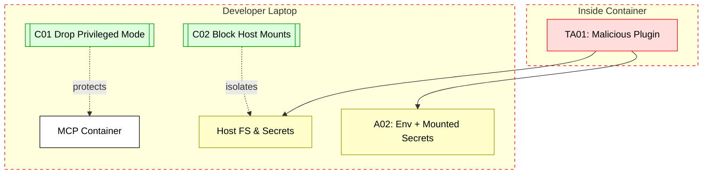

## Scenario:
An enterprise uses lightweight MCP servers inside Docker containers as part of the local developer setup. Each developer runs the MCP container on their laptop to simulate tool calls, while real production tokens are injected through environment variables. The container also mounts local volumes to access shared data (e.g., code repos or test output). 

If a vulnerability exists in the MCP image (e.g., SSRF + Docker socket exposure), a malicious input or plugin could allow container escape or unintended access to host resources, including environment variables containing credentials.

## Threat Landscape:
Developers often run containers with `--privileged`, `-v /:/host`, or exposed Docker sockets for convenience. When the MCP container runs with host-level privileges and sensitive mounts, any compromise of the container can quickly escalate to compromise of the host machine. This includes secrets, SSH keys, or even the ability to spawn additional containers.

## Assets (A):
* A01: Host machine credentials (e.g., SSH keys, GitHub tokens).
* A02: Secrets mounted into container (e.g., test tokens, API keys).
* A03: Host filesystem exposed to container.

## Threat Actors (TA):
* TA01: Malicious plugin or code executed inside the container.
* TA02: Rogue tool call or input that triggers SSRF or file system escape.

## Security Controls (C):
* C01: Run containers with least privilege and drop `--privileged` flag.
* C02: Use `readOnlyRootFilesystem`, avoid sensitive host mounts.
* C03: Scan MCP image for vulnerabilities regularly.
* C04: Do not pass real secrets into local test containers; use mocked tokens.

## Zones:
* Developer Host (semi-trusted)
* Container Runtime (local Docker environment)
* MCP Container (simulated tool environment)

## References
1. OWASP Docker Top 10

2. [MCP Server Containerization Best Practices](https://docs.mcp.run/blog/2025/05/14/mcp-sso/)
