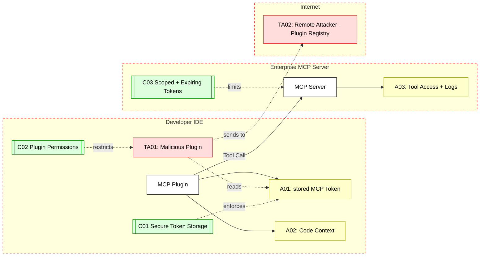

## Scenario:
A developer installs an IDE plugin that integrates with an MCP server to allow invoking tools like test execution, documentation lookup, or code analysis directly from the code editor. To authenticate, the plugin stores the user’s access token locally (e.g., in a settings file or keychain). This token is then attached to tool invocation requests made from the IDE to the MCP server.

Over time, developers install multiple plugins or extensions. One of them (malicious or compromised) reads the IDE’s config directory or intercepts the plugin’s requests. This rogue plugin extracts the user’s MCP access token and exfiltrates it to an attacker-controlled server. The attacker now has access to the user’s tools and data in the MCP environment and can make tool invocations that appear legitimate.

## Threat Landscape:
MCP tokens stored insecurely in local IDEs can be harvested by malicious extensions. Most IDEs do not sandbox plugins fully. This creates a broad attack surface where any plugin, if compromised, can read sensitive plugin data or intercept communications. Unlike browser environments that implement better origin-based isolation and sandboxing, IDEs often lack granular permission control. This increases the risk of credential theft, especially in large developer teams using custom tools.

## Assets (A):
* A01: MCP access token stored on developer machine.
* A02: Developer workspace context (e.g., code snippets, file paths) passed to the tool.
* A03: MCP server resources (tools, logs, audit history) accessible with the token.

## Threat Actors (TA):
* TA01: Malicious plugin or compromised IDE extension reading local files or network requests.
* TA02: Remote attacker who publishes a rogue plugin or compromises a legitimate one.
* TA03: Internal threat (developer with elevated access intentionally harvesting tokens).

## Security Controls (C):
* C01: Secure token storage – use OS keychain or encrypted vaults for plugin secrets.
* C02: Plugin permission manifest – enforce IDE-level policies on what data plugins can access.
* C03: Expiry and scoping of tokens – use short-lived tokens and scope them per plugin or purpose.
* C04: Outbound token monitoring – detect anomalies in token usage from unusual environments or geolocations.

## Zones:
* Developer IDE (local, semi-trusted – user plugins run here)
* MCP Server (internal enterprise zone)
* Internet (potential plugin registry or C2 server for exfiltration)

## References
1. [modelcontextprotocol.io](https://modelcontextprotocol.io/specification/draft/basic/security_best_practices#:~:text=Token%20storage)

2. [JetBrains IDE Security Guidelines](https://plugins.jetbrains.com/docs/intellij/plugin-security.html)

3. [VSCode Plugin Security](https://code.visualstudio.com/docs/editor/extension-marketplace#_extension-signing)