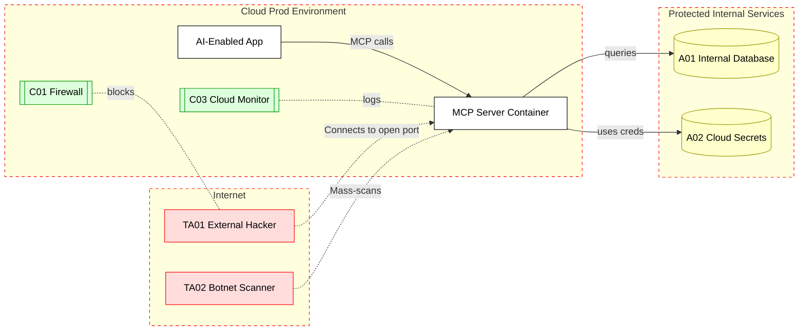

## Scenario: 

An organization deploys an MCP server in a cloud container (e.g., a Docker container on Kubernetes) to facilitate AI-based tool integration in production. For example, a microservice uses an MCP server to let an AI agent access a database or an internal API. The MCP container is inadvertently left listening on 0.0.0.0:443 (open to the internet) for convenience.
## Threat Landscape: 

An exposed MCP endpoint in production becomes a target for external attackers scanning for open ports. If not protected, attackers could directly connect to the MCP server, invoke its tools, and thus gain entry into internal systems. This effectively bypasses traditional perimeter defenses, as the MCP server might have access to sensitive resources (database, internal APIs) once connected. Additionally, if the MCP service is not rate-limited or monitored, it could be co-opted into botnets or abused for DDoS. This scenario turns an internal integration tool into a potential backdoor from the internet.
## Assets (A):
* A01: Internal data or services exposed via MCP (e.g., a database, file storage, or privileged API that the MCP server can reach in the protected network).
* A02: Cloud infrastructure resources accessible by the MCP container (credentials, metadata, etc., if the container has a cloud role).
Threat Actors (TA):
* TA01: External attacker (internet) – scans and finds the open MCP port, then issues unauthorized tool commands to retrieve data or control internal systems.
* TA02: Botnet opportunist – an attacker or malware that exploits the open MCP to run arbitrary commands (possibly turning the host into a botnet node or using it to pivot further into the network).
## Security Controls (C):
* C01: Network segmentation & firewall – ensure MCP services are bound to localhost or a private network, not exposed to the public internet. Use cloud security groups or firewalls to restrict access.
* C02: Authentication and authorization on MCP – require strong authentication (e.g. API keys, OAuth tokens) for any MCP client connecting, to prevent untrusted access.
* C03: Monitoring and threat detection – employ runtime security agents or cloud monitoring (e.g., Defender for Cloud) to detect unusual MCP activity or unauthorized access attempts.
* C04: Rate limiting and abuse prevention – to mitigate brute-force or DDoS attempts on the MCP endpoint.
## Zones:
* Internet (untrusted zone from which attacker scans)
* Cloud VPC (production container environment – protected zone, should not be directly reachable from the internet)
* Internal Services (the data stores or APIs that MCP can access, possibly in a further restricted subnet)

## References
1. [techcommunity.microsoft.com](https://techcommunity.microsoft.com/blog/microsoftdefendercloudblog/plug-play-and-prey-the-security-risks-of-the-model-context-protocol/4410829#:~:text=Public%20MCP%20endpoints)