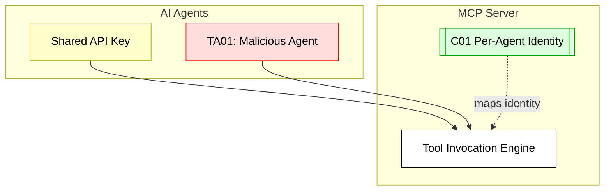

## Scenario:
An MCP server is shared by multiple AI agents running under a team account. They all use the same static API key to authenticate with the MCP. Since the key is shared and there is no additional identity layer, it is impossible to distinguish which agent made which request. If a malicious or misbehaving agent triggers a harmful tool call, attribution becomes infeasible.

## Threat Landscape:
Shared secrets are common in simple deployments, but they undermine auditability and accountability. If any agent or script leaks the key, the entire environment is compromised. Without unique identities, revocation is all-or-nothing.

## Assets (A):
* A01: MCP server access.
* A02: Tool usage logs and audit trails.
* A03: API key (shared credential).

## Threat Actors (TA):
* TA01: Malicious agent using shared key.
* TA02: External actor who obtained the key from one agent.

## Security Controls (C):
* C01: Use per-agent scoped credentials.
* C02: Rotate API keys periodically with expiry.
* C03: Add identity attribution metadata to every request.

## Zones:
* AI Agents
* MCP Server
* Tool Backend

