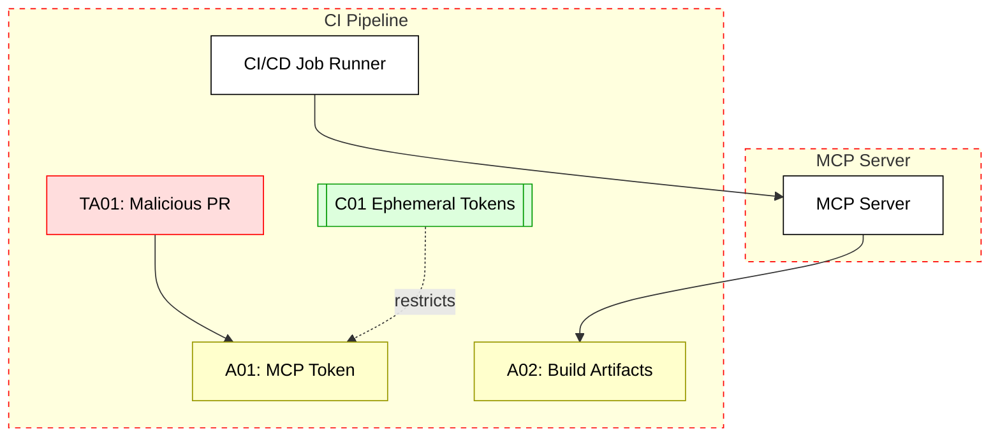

## Scenario:
An organization embeds an MCP server inside its CI/CD pipeline to provide tool access (e.g., test coverage reports, artifact scanning) triggered by GitHub Actions or Jenkins jobs. The MCP client in the pipeline uses an access token stored in environment variables or secrets.

Suppose an attacker compromises the CI pipeline (e.g., via a malicious PR or exposed GitHub Action secret). In that case, they can extract the MCP token and misuse it to invoke tools or leak internal project data. 

## Threat Landscape:
CI pipelines are frequent targets for supply chain attacks. Since MCP is now part of the CI runtime, any compromise of that environment grants full tool access. If the token is long-lived or highly scoped, it becomes a valuable pivot point.

## Assets (A):
* A01: Access token for MCP tools.
* A02: Build artifacts, source code, logs.
* A03: Internal CI secrets and tool output.

## Threat Actors (TA):
* TA01: Malicious PR contributor or attacker with repo access.
* TA02: CI/CD insider threat or misconfigured job runner.

## Security Controls (C):
* C01: Use short-lived, minimally scoped tokens per pipeline.
* C02: Isolate untrusted jobs (e.g., forks) into separate runners.
* C03: Add environment-based token binding (e.g., IP, job ID).
* C04: Mask and restrict secrets in CI logs.

## Zones:
* CI Pipeline Runner (e.g., GitHub Actions)
* MCP Server
* Internal Git or Build Artifact Zone

