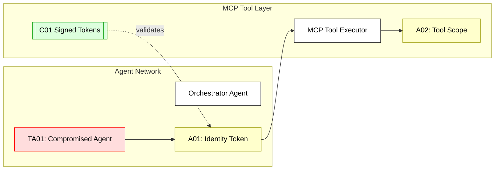

## Scenario:
In an agentic system using MCP, agents delegate tasks to each other by passing scoped tokens. An orchestrator agent invokes a planner agent, which then calls tools on the user’s behalf. Tokens are passed inline in requests to support seamless invocation.

An attacker controlling an agent injects a fake identity token or reuses an old delegation token to impersonate a high-privileged user.

## Threat Landscape:
Multi-agent chains complicate trust boundaries. If tokens are reused or validated improperly, identity spoofing occurs. This breaks the principle of least privilege and could allow one agent to escalate scope or act outside of policy.

## Assets (A):
* A01: User identity token (delegated).
* A02: Tool scopes and access logs.
* A03: Agent credentials.

## Threat Actors (TA):
* TA01: Compromised agent forging delegation token.
* TA02: Malicious orchestrator agent replaying a previous session.

## Security Controls (C):
* C01: Use signed and timestamped delegation tokens.
* C02: Implement token expiry and audience restriction.
* C03: Monitor agent call chains for anomaly detection.

## Zones:
* User Agent
* Orchestrator Agent
* MCP Tool Layer

