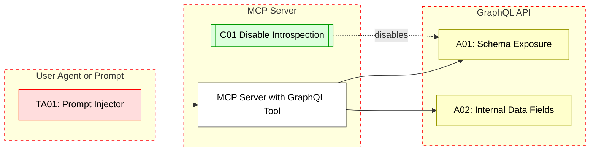

## Scenario:
An MCP server includes a GraphQL-based tool (e.g., schema explorer, dashboard query, reporting) that communicates with an internal GraphQL API. For convenience, introspection is enabled to allow agents to understand schema types and query structures. However, this introspection endpoint is also exposed to unauthenticated users or indirectly accessible from prompt-engineered LLM calls.

An attacker could use the exposed introspection to enumerate all types, fields, and mutations – then craft malicious queries to extract sensitive fields not meant for public or AI use.

## Threat Landscape:
GraphQL introspection endpoints, if exposed, allow full visibility into backend data models. Prompt injection or unvalidated tool invocations can give LLMs or attackers access to internal data logic, field names, and even admin mutations.

## Assets (A):
* A01: GraphQL schema (includes hidden mutations or internal fields).
* A02: Data exposed via GraphQL (e.g., user secrets, logs).

## Threat Actors (TA):
* TA01: Prompt injector or user bypassing normal UI.
* TA02: Scripted attacker scanning for introspection endpoints.

## Security Controls (C):
* C01: Disable introspection in production.
* C02: Use GraphQL query depth limiting and rate limiting.
* C03: Apply field-level auth controls even on introspected types.

## Zones:
* User (Agent prompt or API)
* MCP Server
* Internal GraphQL API

