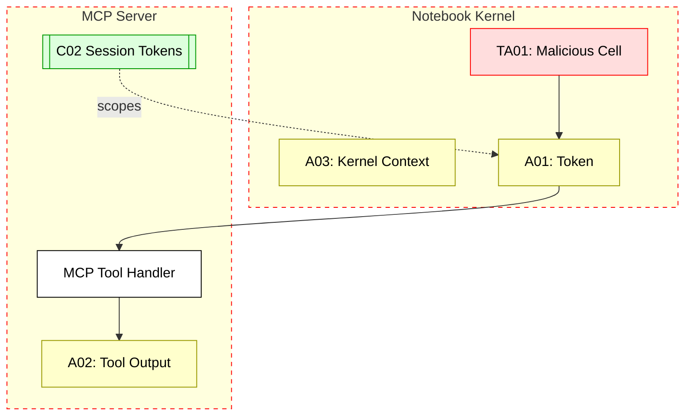

## Scenario:
An MCP extension is added to Jupyter notebooks to allow developers or data scientists to query tools and generate summaries inside cells. The MCP plugin shares context like code cells and cell outputs with the server.

Suppose a malicious user injects code that executes as part of a shared notebook (e.g., via collaboration). In that case, they can steal access tokens, alter tool context, or even embed scripts that hijack the MCP request lifecycle.

## Threat Landscape:
Jupyter notebooks are inherently insecure when used in shared or multi-tenant environments. Kernel access allows arbitrary code execution. When MCP tools are embedded in the notebook UI or cell output, they become attack surfaces for code injection and impersonation.

## Assets (A):
* A01: MCP access token or cookies.
* A02: Tool input/output context shared between notebook and MCP.
* A03: Notebook execution context.

## Threat Actors (TA):
* TA01: Notebook collaborator injecting malicious cells.
* TA02: Remote attacker exploiting an open Jupyter port.

## Security Controls (C):
* C01: Use signed and sandboxed kernels for shared notebooks.
* C02: Scope MCP tokens to individual sessions with expiration.
* C03: Avoid storing tokens in notebook variables or outputs.

## Zones:
* Notebook Frontend (browser)
* Jupyter Kernel (code execution)
* MCP Server

