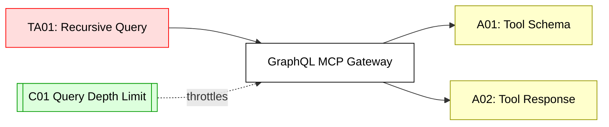

## Scenario:
An MCP gateway is built on top of a GraphQL API that dynamically resolves tool calls based on introspection and schema. The AI agent can construct queries like:

```graphql
query {
  callTool(name: "fetch_weather", input: { city: "Paris" }) {
    result
  }
}
```

But if schema validation is weak, attackers can overfetch fields, introspect all tools, or inject deeply nested queries to overload the server.

## Threat Landscape:
GraphQL’s flexibility makes it prone to overfetching, DoS, and resolver chaining if not guarded. An attacker can construct recursive queries or exploit resolver bugs in tool metadata lookups.

## Assets (A):
* A01: Full schema of available tools.

* A02: Backend tool response data.

* A03: MCP server memory/CPU.

## Threat Actors (TA):
* TA01: External attacker using recursive queries.

* TA02: Authenticated user fetching unauthorized fields.

## Security Controls (C):
* C01: Limit query depth and complexity with rules.

* C02: Enable introspection only in dev.

* C03: Add query cost estimation + caching.

## Zones:
* Public Agent (GraphQL Client)

* MCP Gateway (GraphQL Server)

* Tool Execution Layer



