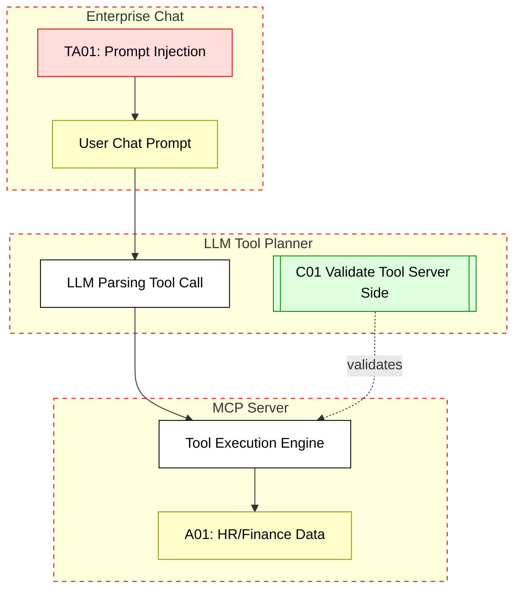

## Scenario:
An MCP server is integrated as a plugin in an enterprise chat system (e.g., Slack, MS Teams, or internal chatops platform). Employees ask natural language questions, which are interpreted and routed to the MCP tools. However, users discover that specially crafted prompts can manipulate the tool invocation layer – for example, by injecting new commands via escape characters or LLM hallucinations.

This can cause tools to be executed with parameters not intended by the original user or trigger access to information outside the user’s role scope.

## Threat Landscape:
The LLM parsing the chat input may be vulnerable to prompt injection. If the MCP server blindly trusts the LLM output (e.g., tool name, parameters), a malicious user can influence the LLM to insert alternate tool names, override user identity, or escalate scope.

## Assets (A):
* A01: Enterprise data accessed via tools (e.g., HR, finance).
* A02: Identity or permission mapping sent to tools.
* A03: Chat history and sensitive user queries.

## Threat Actors (TA):
* TA01: Internal employee crafting malicious prompt injection.
* TA02: External attacker through shared chat links (if open access).

## Security Controls (C):
* C01: Validate tool and parameter mappings server-side, not via LLM output alone.
* C02: Use tool signature hashing to detect tampered invocations.
* C03: Isolate prompt processing from permission context derivation.

## Zones:
* Enterprise Chat Platform
* LLM / Orchestrator
* MCP Server (tool execution)
* Backend Tools

