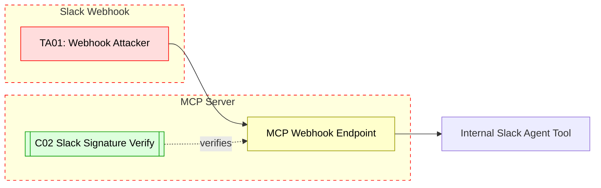

## Scenario:
An MCP server includes a Slack-based agent to receive tool requests and return answers. Slack incoming webhooks are configured to send messages to the MCP server. However, webhook URLs are stored in plaintext in the config or leaked in logs. An attacker gains access to the webhook and sends spoofed requests mimicking users or agents.

The attacker can issue arbitrary tool calls using the webhook, masquerading as a legitimate Slack user.

## Threat Landscape:
Webhook URLs are essentially bearer tokens. If leaked or misconfigured, they allow direct invocation of sensitive APIs. Since many MCP tools are designed to trust internal message formats, spoofing the origin can result in unauthorized access or tool abuse.

## Assets (A):
* A01: Webhook endpoint to MCP.
* A02: Slack-integrated tool invocations.
* A03: Agent identity linked to Slack messages.

## Threat Actors (TA):
* TA01: Attacker with access to leaked webhook URL.
* TA02: Insider who reuses or forwards URLs maliciously.

## Security Controls (C):
* C01: Rotate webhook secrets regularly.
* C02: Verify Slack signatures and timestamps.
* C03: Restrict webhook access via IP allowlisting or HMAC.

## Zones:
* Slack (external event source)
* MCP Server
* Internal Agent logic

