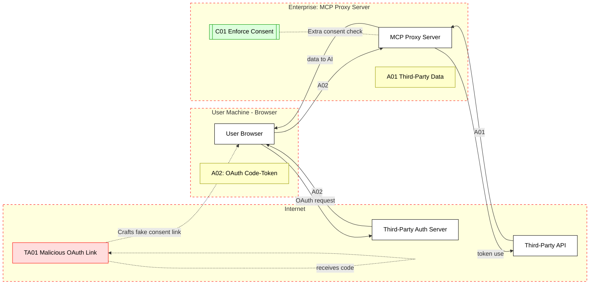

## Scenario: 

An enterprise uses an MCP server as a proxy to connect AI assistants with a third-party API service. For example, an MCP server provides a unified interface to an external CRM or analytics API. Because the third-party authorization service doesn’t support dynamic client registration for each AI user, the MCP proxy uses a static OAuth client ID for all requests to the third-party API. Users authenticate through the MCP, which then uses its static credentials to obtain access tokens from the external API.

## Threat Landscape: 
This setup is prone to a confused deputy attack. An attacker can exploit the static client ID: after a user has once consented to the MCP proxy, the third-party sees that consent cookie and might not prompt again. An attacker could trick the user into clicking a malicious authorization link that uses the static client ID but a different redirect URI controlled by the attacker. Because the user’s browser has a valid consent cookie (from earlier legitimate use), the third-party authorization skips user consent, and issues a code to the attacker’s redirect URI. The attacker exchanges this for tokens and gains access to the third-party API as the user – effectively fooling the authorization flow by leveraging the MCP’s static identity.

## Assets (A):
* A01: Third-party API data accessible via MCP (e.g., CRM records, analytics data – which the user should only release with consent).
* A02: OAuth authorization code/token for the third-party API (which grants access to A01).
## Threat Actors (TA):
* TA01: External attacker who crafts malicious OAuth URLs – tricking users into an unintended authorization that leverages the MCP’s standing consent.
* TA02: (Optional) Malicious user or compromised client abusing token flows – but primary is the external attacker in this case.
## Security Controls (C):
* C01: Per-client consent enforcement – the MCP proxy must ensure each new OAuth client (or redirect URI) requires fresh user consent, even if using a static ID. Do not rely solely on the third-party’s cookie in such flows.
* C02: Parameter validation – the MCP should validate redirect URIs and client IDs in any OAuth handshake it facilitates, to prevent unknown values from being used.
* C03: User education and out-of-band confirmation – inform users to be cautious of unexpected authorization requests, possibly confirming important consents through a second channel.
## Zones:
* User’s Browser/Machine (where the OAuth flow is initiated – semi-trusted)
* Internet (Attacker + Third-Party) – attacker and third-party auth server on public internet
* MCP Proxy Server (enterprise zone, acts as client to third-party API)
* Third-Party API Backend (external service providing data)

## References
1. [modelcontextprotocol.io](https://modelcontextprotocol.io/specification/draft/basic/security_best_practices#:~:text=Mitigation)
2. [modelcontextprotocol.io](https://modelcontextprotocol.io/specification/draft/basic/security_best_practices#:~:text=MCP%20Proxy%20Server%20%3A%20An,party%20API%20server)